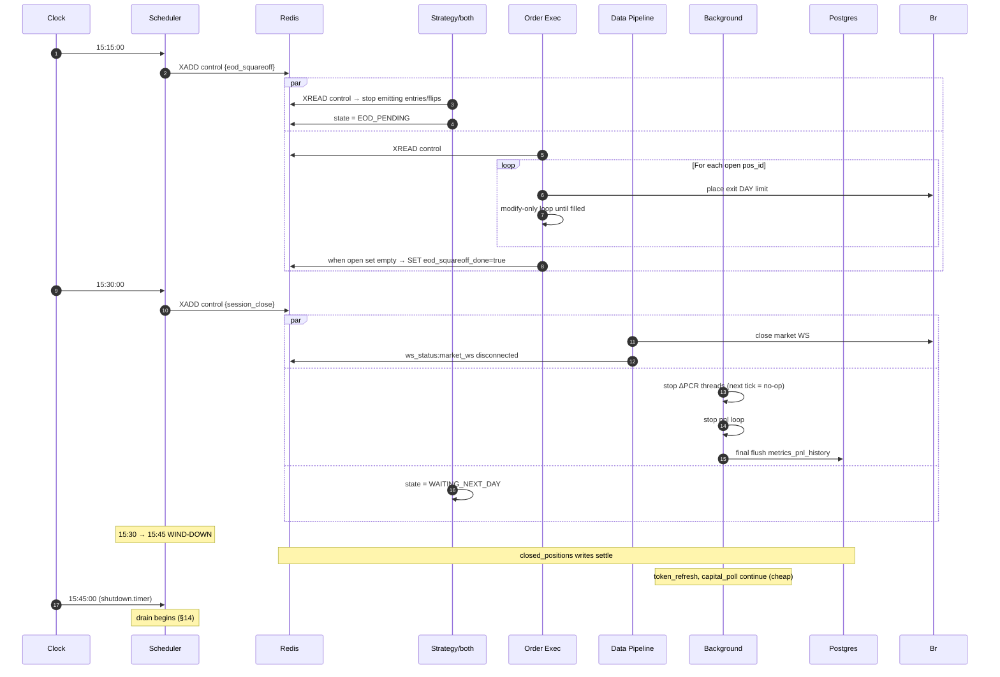
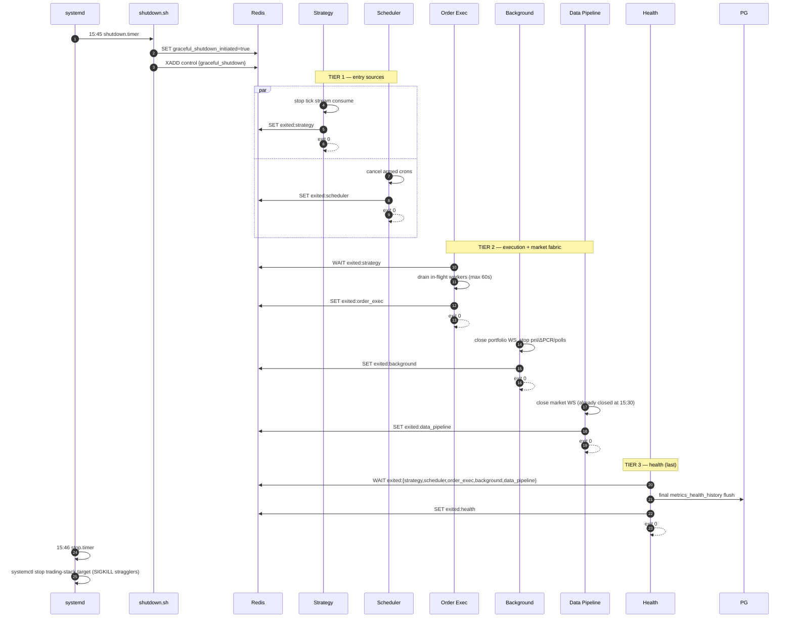

# Sequential Flow & Lifecycle — Multi-Strategy Trading Bot

> **Note (2026-05-07):** the daily lifecycle, systemd timer behaviour, and
> drain ordering described below are still current. The per-tick strategy
> decision flow has changed — see `Strategy.md` §2 (vessel architecture)
> and §5 (decision logic). The "premium-diff" decision-tree sections in
> this doc are deprecated.


This document is the **single source of truth** for:

1. Which processes are persistent vs cyclic, and why.
2. When each engine starts, idles, and stops, and **who decides**.
3. The full intraday phase machine, from cold to drain.
4. The pre-trade decision tree (holiday, timings, manual override).
5. Readiness gates that engines wait on (no `sleep`, no race).
6. Failsafe behavior at every phase.
7. Recovery semantics for crashes mid-day.

This doc supersedes the lifecycle prose in `HLD.md` §3 and the timing notes scattered across `Strategy.md` §6 and `TDD.md` §8. Once approved, those sections will be trimmed to cross-references.

---

## 1. Persistent vs Cyclic Processes

### 1.1 Persistent (24×7, never restarted except on host reboot)

| Process | Role | Stops only on |
|---|---|---|
| **PostgreSQL** | Durable store: configs, credentials, history, audit | Host reboot |
| **Redis** | Hot state, streams, pub/sub, view cache | Host reboot |
| **Nginx** | TLS termination, reverse proxy for FastAPI + frontend | Host reboot |
| **FastAPI Gateway** | REST + WebSocket; reads Redis/Postgres directly | Host reboot |
| **systemd** | OS-level supervisor (timers + service units) | Host reboot |

**Why FastAPI is persistent**: the user must be able to **set the next-day flags before 08:00** (skip-today, change configs), **review reports overnight**, and **see live health of the persistent layer**. None of this requires the trading engines to be alive.

### 1.2 Cyclic (started 08:00, stopped 15:45 IST, weekdays only)

| Engine | Role | Notes |
|---|---|---|
| **Init** | One-shot bootstrap | `Type=oneshot`; exits 0 → triggers stack |
| **Health** | Heartbeat + dependency monitor | Spawned right after Init |
| **Data Pipeline** | Broker market WS, tick processing, option-chain updates | WS only opens 09:14:00 |
| **Background** | Portfolio WS, PnL, ΔPCR, polls | Some threads idle outside market hours |
| **Strategy** | Per-index decision threads | 2 threads (NIFTY, BANKNIFTY) |
| **Order Exec** | Signal consumer, entry/exit orchestration | 8 worker threads + 1 dispatcher |
| **Scheduler** | Intraday event firer (cron-driven Redis stream events) | Does NOT own start/stop |

**Why these are cyclic**:
- Memory hygiene: Python processes accumulate state; daily restart is cheaper than chasing leaks.
- AWS cost: ~7h/day vs 24h/day cuts EC2 compute by ~70% if the instance is stopped (see §15).
- Clean state: every day starts from canonical Redis template.

### 1.3 Boundary rule

**Persistent processes never depend on cyclic ones.** FastAPI must serve every endpoint correctly when all 7 cyclic engines are stopped — it just shows live views as `null` and routes to Postgres for history.

---

## 2. Daily Schedule (IST, weekdays only)

| Time | Event | Owner |
|---|---|---|
| 08:00:00 | `start.timer` fires → Init starts | systemd |
| 08:00:00 → 08:00:59 | Init runs precheck decision tree (§7) | Init |
| 08:01:00 | If `trading_active=true`: stack target activates | systemd `OnSuccess` |
| 08:01:00 → 09:13:59 | **COLD** phase (engines alive, market closed) | — |
| 09:14:00 | `pre_market_subscribe` event | Scheduler |
| 09:14:00 → 09:14:49 | **PRE-MARKET** WS subscribe + warmup | Data Pipeline |
| 09:14:50 | `pre_open_snapshot` event | Scheduler |
| 09:14:50 → 09:14:59 | Pre-open snapshot capture per index | Strategy + Background |
| 09:15:00 | `session_open` event (clock landmark) | Scheduler |
| 09:15:00 → 09:15:09 | Settle window (skip auction-crossover noise) | Strategy |
| 09:15:10 | Continuous decision loop begins per index | Strategy |
| 09:18:00, 09:21:00, … | `delta_pcr_tick` every 3min until 15:12 | Scheduler |
| 15:15:00 | `eod_squareoff` event | Scheduler |
| 15:15:00 → 15:29:59 | **EOD** force-exit all open positions | Order Exec |
| 15:30:00 | `session_close` event | Scheduler |
| 15:30:00 → 15:44:59 | **WIND-DOWN** final PnL flush, reports settle | Background + Order Exec |
| 15:45:00 | `graceful_shutdown.timer` fires | systemd |
| 15:45:00 → 15:45:59 | **DRAIN** 4-tier exit | All engines |
| 15:46:00 | `stop.timer` fires → SIGKILL stragglers | systemd |
| 15:46:00 → 07:59:59 | **OFF** only persistent layer alive | — |

Saturdays/Sundays: timers do not fire. Holidays: see §7.

---

## 3. The 8 Phases (state machine)

```
                    OFF (15:46 → 08:00 next weekday)
                     │
                     │ start.timer
                     ▼
                 PRECHECK (08:00 → 08:01)
                     │
                ┌────┴────┐
            skip│         │trade
                ▼         ▼
              OFF      COLD (08:01 → 09:14)
                          │
                          │ Sch: pre_market_subscribe
                          ▼
                     PRE-MARKET (09:14:00 → 09:14:49)
                          │
                          │ Sch: pre_open_snapshot
                          ▼
                     OPEN (09:14:50 → 09:15:09)
                          │
                          │ session_open + 10s settle window
                          ▼
                     LIVE (09:15:10 → 15:14:59)
                          │
                          │ Sch: eod_squareoff
                          ▼
                     EOD (15:15:00 → 15:29:59)
                          │
                          │ Sch: session_close
                          ▼
                     WIND-DOWN (15:30:00 → 15:44:59)
                          │
                          │ shutdown.timer
                          ▼
                     DRAIN (15:45:00 → 15:45:59)
                          │
                          │ stop.timer
                          ▼
                          OFF
```

Each phase has explicit entry trigger, exit trigger, and per-engine activity (§4). No phase exits on a `sleep` — every transition is event-driven on a Redis flag or stream.

---

## 4. Per-Engine Activity Matrix

Legend: ✅ active, 💤 alive-but-idle, 🟡 partial threads, ❌ stopped, ⏵ one-shot.

| Process | OFF | PRECHECK | COLD | PRE-MKT | OPEN | LIVE | EOD | WIND-DOWN | DRAIN |
|---|---|---|---|---|---|---|---|---|---|
| Postgres | ✅ | ✅ | ✅ | ✅ | ✅ | ✅ | ✅ | ✅ | ✅ |
| Redis | ✅ | ✅ | ✅ | ✅ | ✅ | ✅ | ✅ | ✅ | ✅ |
| Nginx | ✅ | ✅ | ✅ | ✅ | ✅ | ✅ | ✅ | ✅ | ✅ |
| FastAPI | ✅ (REST only) | ✅ | ✅ | ✅ | ✅ | ✅ | ✅ | ✅ | ✅ |
| Init | ❌ | ⏵ | ❌ | ❌ | ❌ | ❌ | ❌ | ❌ | ❌ |
| Health | ❌ | ❌ | ✅ | ✅ | ✅ | ✅ | ✅ | ✅ | ✅ (last to exit) |
| Data Pipeline | ❌ | ❌ | 💤 (no WS) | ✅ (WS up) | ✅ | ✅ | ✅ | 💤 (WS closed) | drain → ❌ |
| BG: portfolio_ws | ❌ | ❌ | ✅ | ✅ | ✅ | ✅ | ✅ | ✅ | drain → ❌ |
| BG: pnl | ❌ | ❌ | 💤 | 💤 | 💤 | ✅ (1s) | ✅ | 💤 (final flush) | ❌ |
| BG: ΔPCR/idx | ❌ | ❌ | 💤 | 🟡 (baseline) | 💤 | ✅ (3min) | 💤 | 💤 | ❌ |
| BG: token / capital / kill_sw polls | ❌ | ❌ | ✅ | ✅ | ✅ | ✅ | ✅ | ✅ | ❌ |
| Strategy/idx | ❌ | ❌ | 💤 (gate-wait) | 💤 (snapshot) | ✅ | ✅ | 🟡 (no new entries) | 💤 | ❌ |
| Order Exec | ❌ | ❌ | 💤 (queue empty) | 💤 | ✅ | ✅ | ✅ (force-exits only) | 💤 | drain → ❌ |
| Scheduler | ❌ | ❌ | ✅ | ✅ (fires) | ✅ | ✅ (fires) | ✅ (fires) | ✅ (fires) | ❌ |

**Key invariants**:
- Postgres + Redis + Nginx + FastAPI are ✅ in every column.
- Health is the **first cyclic engine up** and **last cyclic engine down** — so heartbeats are recorded the entire time other engines exist.
- Data Pipeline opens broker WS at 09:14:00 and closes at 15:30:00. Saves bandwidth for the 18.5h non-trading window.

---

## 5. Lifecycle Ownership: Who Stops Whom

### 5.1 The rule

**No engine stops another engine.** All starts and stops are owned by either:
- **systemd timers** (boundaries: 08:00, 15:45, 15:46) — daily on/off
- **Self-exit on stream event** (intraday: `graceful_shutdown` event arrives → engine drains and exits)

The Scheduler engine fires intraday events via `XADD system:stream:control`. It does **not** start or stop anything; it only emits.

### 5.2 systemd unit topology

Deployed unit names use the `pcr-` prefix (canonical files in `scripts/systemd/`):

```
pcr-stack.target                                (groups all cyclic engines)
                                                Requires=pcr-init.service
                                                After=pcr-init.service
                                                Wants=pcr-{scheduler,data-pipeline,background,
                                                            strategy,order-exec,health}.service

├─ pcr-init.service                             Type=oneshot, RemainAfterExit=yes
│                                               Wants=pcr-stack.target  (pulls stack up after
│                                                                        init goes "active")
├─ pcr-health.service                           After=pcr-init.service, PartOf=pcr-stack.target
├─ pcr-data-pipeline.service                    After=pcr-init.service, PartOf=pcr-stack.target
├─ pcr-background.service                       After=pcr-init.service, PartOf=pcr-stack.target
├─ pcr-strategy.service                         After=pcr-init.service, PartOf=pcr-stack.target
├─ pcr-order-exec.service                       After=pcr-init.service, PartOf=pcr-stack.target
├─ pcr-scheduler.service                        After=pcr-init.service, PartOf=pcr-stack.target
└─ (pcr-api-gateway.service: persistent — NOT in stack.target; runs 24/7)

pcr-stop.service              Type=oneshot, ExecStart=/usr/local/bin/pcr-shutdown.sh
                              (publishes graceful_shutdown event, sleeps 60 s, then
                              `systemctl stop pcr-stack.target` and `pcr-init.service`)

pcr-start.timer    OnCalendar=Mon-Fri 08:00:00 Asia/Kolkata     → pcr-init.service
pcr-stop.timer     OnCalendar=Mon-Fri 15:45:00 Asia/Kolkata     → pcr-stop.service
```

The dependency pattern is `Wants=` (not `OnSuccess=`) because `RemainAfterExit=yes` is required so
that `pcr-stack.target`'s `Requires=pcr-init.service` stays satisfied for the whole trading day.
With `OnSuccess=`, the init service would only fire its successor at the inactive transition — which
never happens with `RemainAfterExit=yes`. The `Wants=pcr-stack.target` in the init unit queues the
target alongside, and the target's `After=pcr-init.service` makes it wait for init success.

### 5.3 The shutdown script

`/usr/local/bin/pcr-shutdown.sh` (versioned at `scripts/pcr-shutdown.sh`) is short and does not
import any engine code:

```bash
#!/bin/sh
set -e
SOCK=/var/run/redis/redis.sock
redis-cli -s "$SOCK" SET system:flags:graceful_shutdown_initiated true >/dev/null
redis-cli -s "$SOCK" XADD system:stream:control '*' event graceful_shutdown >/dev/null
sleep 60
systemctl stop pcr-stack.target
systemctl stop pcr-init.service
exit 0
```

Engines see the event on `system:stream:control`, drain in tiers (§13), and self-exit. The
`systemctl stop pcr-stack.target` after 60 s catches stragglers (SIGTERM with `TimeoutStopSec`,
then SIGKILL). Stopping `pcr-init.service` clears its `RemainAfterExit=yes` "active" status so
tomorrow morning's timer fire actually re-runs the precheck.

### 5.4 Start trigger

`pcr-init.service` has `Wants=pcr-stack.target` and `RemainAfterExit=yes`. So:
- Init exits 0 with `trading_active=true` → init stays "active", stack.target activates,
  engines run normally.
- Init exits 0 with `trading_disabled_reason ∈ {awaiting_credentials, auth_invalid}` → stack
  comes up **IDLE**: FastAPI + frontend serve the UI so the user can enter / fix Upstox
  credentials, but Strategy / Data Pipeline / Order Exec stay parked on the readiness gate.
  This is the credential-bootstrap path.
- Init exits 0 with `trading_disabled_reason ∈ {holiday, manual_kill}` (skip / holiday /
  non-standard timings) → stack does **not** come up; cyclic engines stay off; OS idles until
  next 08:00. This is the cost-saving path.
- Init exits non-zero (Redis/Postgres down, infra-level auth crash) → `OnFailure=trading-alert.service` fires (email/webhook), stack does **not** come up.

The distinction matters: missing user credentials is **not** an Init failure — it is an expected first-run state and must leave the UI reachable. Only infra failures justify exit 1.

---

## 6. User Flags & Manual Override

The frontend can write to these flags via FastAPI at any time. Init reads them at 08:00.

| Flag (Redis key) | Type | Default | Effect |
|---|---|---|---|
| `system:flags:auto_continue` | STRING `"true"`/`"false"` | `"true"` | Master switch. If `"false"`, Init skips the day regardless of all other checks. Persists across days. |
| `system:flags:skip_today` | STRING `"true"`/`"false"` | `"false"` | One-shot skip for today. Init reads, then resets to `"false"` after acting (whether or not it skipped). |
| `system:flags:force_paper_today` | STRING `"true"`/`"false"` | `"false"` | One-shot: forces `mode=paper` regardless of `system:flags:mode`. Useful for "I want to watch but not trade real money today". Reset after Init. |
| `system:flags:mode` | STRING `"paper"`/`"live"` | `"paper"` | Persistent. Overridden one-shot by `force_paper_today`. |
| `system:flags:trading_active` | STRING `"true"`/`"false"` | written by Init | Computed result. Engines read this, never the user. |

### 6.1 Frontend UX (pseudo-spec)

```
[ Trading Day Settings ]

  ☑ Auto-continue every weekday      (auto_continue)
  ☐ Skip tomorrow                    (skip_today)
  ☐ Force paper mode tomorrow        (force_paper_today)

  Mode:  ( ) Live   (•) Paper        (mode)

  Save   →   writes the 4 flags to Redis via PUT /flags
```

After Init runs at 08:00, both `skip_today` and `force_paper_today` are auto-cleared. Auto-continue and mode persist.

---

## 7. Init Precheck Decision Tree (the daily go/no-go)

This is **the** critical sequence. Every step is fail-stop unless noted.

```
08:00:00  Init starts
  │
  ├─ STEP 1: Connect to Redis
  │    fail → exit 1 (alert)
  │
  ├─ STEP 2: Connect to Postgres
  │    fail → exit 1 (alert)
  │
  ├─ STEP 3: Apply Redis canonical template
  │           (FLUSH runtime namespaces, write defaults)
  │    fail → exit 1 (alert)
  │
  ├─ STEP 4: Hydrate from Postgres
  │           (user_account, user_credentials, config_*, market_calendar)
  │    fail → exit 1 (alert)
  │
  ├─ STEP 5: Read user flags
  │    auto_continue == "false"   → SET trading_active=false; exit 0 (no stack)
  │    skip_today    == "true"    → SET skip_today="false"; SET trading_active=false; exit 0 (no stack)
  │
  ├─ STEP 6: Bootstrap Upstox auth
  │    a) SELECT encrypted_value FROM user_credentials WHERE broker='upstox'
  │       row missing OR decrypt fails →
  │           SET system:health:auth = "missing"
  │           SET system:flags:trading_disabled_reason = "awaiting_credentials"
  │           SET system:flags:trading_active = "false"
  │           SKIP Steps 7–11 (broker calls impossible without creds)
  │           goto STEP 12 (mark init_done; exit 0; stack comes up IDLE)
  │    b) Decrypt → cache to user:credentials:upstox (Redis JSON)
  │    c) Probe /v2/user/profile with cached access_token
  │    d) Profile 200 → SET system:health:auth = "valid"; continue
  │    e) Profile 401 / token expired →
  │           attempt v3 token refresh (request_access_token, wait ≤600s for webhook)
  │           webhook arrives + reprobe 200 → "valid"; continue
  │           else →
  │               SET system:health:auth = "invalid"
  │               SET system:flags:trading_disabled_reason = "auth_invalid"
  │               SET system:flags:trading_active = "false"
  │               SKIP Steps 7–11
  │               goto STEP 12 (stack comes up IDLE; user fixes via UI)
  │    Infra failure (Redis/PG unreachable mid-step) → exit 1 (alert)
  │
  ├─ STEP 7: Broker holiday check  /v2/market/holidays
  │    Today is in holidays list → SET trading_active=false; exit 0 (no stack)
  │    (Postgres market_calendar is fallback if API unreachable)
  │
  ├─ STEP 8: Broker market timings  /v2/market/timings/{today}
  │    For exchange = NSE:
  │      open  != "09:15"  OR  close != "15:30"
  │        → log "non-standard session today: open=X close=Y"
  │        → SET trading_active=false; exit 0 (no stack)
  │      open  == "09:15"  AND  close == "15:30"
  │        → SET market:session:today = {open, close, source: broker}
  │
  ├─ STEP 9: Broker market status  /v2/market/status/NSE_FO
  │    status != "NORMAL_OPEN" (currently or scheduled to open)
  │      → SET trading_active=false; exit 0 (no stack)
  │
  ├─ STEP 10: Resolve mode
  │    if force_paper_today == "true":
  │      effective_mode = "paper"
  │      SET force_paper_today="false"
  │    else:
  │      effective_mode = mode
  │    SET system:flags:mode_today = effective_mode
  │
  ├─ STEP 11: Per-index basket build
  │    For each enabled index (nifty50, banknifty):
  │      a) Fetch spot LTP
  │      b) Compute ATM
  │      c) Fetch option contracts; discover nearest expiry
  │      d) Build option_chain template (ATM ± 6)
  │      e) Build trading basket (ATM ± 2)
  │      f) Persist meta + chain template + basket
  │      g) SADD market:subscriptions:desired
  │    Any per-index failure: SET strategy:{index}:enabled=false; continue with the OTHER index
  │    BOTH indexes failed: SET trading_active=false; exit 0 (no stack)
  │
  ├─ STEP 12: Final readiness
  │    SET system:flags:init_done=true
  │    SET system:flags:trading_active=true
  │    PUBLISH system:pub:system_event {ready}
  │
  └─ exit 0  → systemd OnSuccess → trading-stack.target activates
```

### 7.1 Broker SDK calls used by the precheck

All calls go through the `UpstoxAPI` facade (`backend/brokers/upstox/client.py`); each returns the standard envelope `{success, data, error, code, raw}`.

| Step | UpstoxAPI call | Endpoint | Purpose |
|---|---|---|---|
| 6 | `validate_token` / `request_access_token` | `/v2/user/profile`, `/v3/login/auth/token/request/{client_id}` | Token validity probe + v3 user-approved request |
| 7 | `get_holidays` + `is_holiday_for` | `/v2/market/holidays` | Holiday gate (fail-closed predicate) |
| 8 | `get_market_timings` + `is_standard_session` | `/v2/market/timings/{date}` | Standard 09:15–15:30 session check |
| 9 | `get_market_status` + `is_market_open` | `/v2/market/status/{exchange}` | Real-time session-status probe |
| 11 | `get_ltp` + `get_option_contracts` + `nearest_expiry` | `/v3/market-quote/ltp`, `/v2/option/contract` | Spot LTP, contract list, nearest-expiry resolution |
| 11 | `download_master_contract` | CDN `NSE.json.gz` | Full instruments cache (rebuilt daily) |

Background ΔPCR baseline (09:14:50) uses `UpstoxAPI.get_option_chain` (`/v2/option/chain`) to capture the OI snapshot for the dynamic ATM ± 2 strike set.

### 7.2 Cached fallback policy

Each of Steps 7, 8, 9 has a 5-second timeout. On timeout:
- Read `market:cache:{holidays|timings|status}:last` from Redis (last successful fetch).
- If cache age < 24h → use cache, log WARN.
- If cache age ≥ 24h → fail-stop the step (treat as service down).

This means a transient broker REST flap doesn't kill the day, but a stale broker doesn't fool us into trading on a holiday.

---

## 8. Readiness Gates (the only allowed cross-engine waits)

No engine ever uses `time.sleep` to wait for another engine. Every wait is on one of these flags:

| Gate | Writer | Set when | Waiter(s) |
|---|---|---|---|
| `system:flags:init_done` | Init | After Step 11 of precheck | All engines (boot) |
| `system:flags:trading_active` | Init | After all checks pass | Strategy, Order Exec |
| `system:flags:engine_up:{name}` | Each engine | First successful main-loop iteration | Health (alarms after 30s); dashboard view |
| `system:flags:data_pipeline_subscribed` | Data Pipeline | All subscribed tokens emitted ≥ 1 frame OR 30s after subscribe | Strategy (pre-open snapshot); Background ΔPCR (baseline) |
| `system:flags:pre_open_captured:{index}` | Strategy/idx | After 09:14:50 snapshot persisted with non-zero ts on every basket strike | Strategy continuous loop; BG ΔPCR/idx |
| `system:flags:eod_squareoff_done` | Order Exec | When `orders:positions:open` empties post-15:15 | Strategy (state=WAITING_NEXT_DAY); BG (final PnL flush) |
| `system:flags:session_closed` | Scheduler | At 15:30 | Data Pipeline (close WS); BG (stop ΔPCR) |
| `system:flags:graceful_shutdown_initiated` | shutdown.sh | At 15:45 | All cyclic engines (start drain) |
| `system:lifecycle:exited:{name}` | Each engine | Last action before `exit 0` | Next-tier engines (drain ordering) |

All gates are cleared by Init's runtime FLUSH at 08:00 next day.

---

## 9. Boot Sequence (08:00 → COLD ready)

```mermaid
sequenceDiagram
    autonumber
    participant Sd as systemd
    participant Init
    participant Redis
    participant PG as Postgres
    participant Br as Upstox REST
    participant Stack as cyclic engines

    Sd->>Init: 08:00 start.timer fires
    activate Init
    Init->>Redis: connect (Unix socket)
    Init->>PG: connect (asyncpg)
    Init->>Redis: FLUSH runtime; apply canonical template
    Init->>PG: SELECT configs, credentials, market_calendar
    Init->>Redis: hydrate user:* config:* calendar:*
    Init->>Redis: GET flags (auto_continue, skip_today, force_paper_today, mode)
    alt auto_continue=false OR skip_today=true
        Init->>Redis: SET skip_today=false (consume)
        Init->>Redis: SET trading_active=false
        Init-->>Sd: exit 0 (no OnSuccess effect; stack stays down)
    else continue
        Init->>Br: probe /v2/user/profile (token validity)
        alt Token invalid
            Init->>Br: Playwright OR wait webhook (≤10min)
            Init->>Redis: persist new token
        end
        Init->>Br: GET /v2/market/holidays
        alt Today is holiday
            Init->>Redis: SET trading_active=false
            Init-->>Sd: exit 0 (no stack)
        end
        Init->>Br: GET /v2/market/timings/today
        alt Non-standard session
            Init->>Redis: SET trading_active=false
            Init->>Redis: XADD health alerts WARN
            Init-->>Sd: exit 0 (no stack)
        end
        Init->>Br: GET /v2/market/status/NSE_FO
        alt Status not NORMAL_OPEN
            Init->>Redis: SET trading_active=false
            Init-->>Sd: exit 0 (no stack)
        end
        loop For each index
            Init->>Br: get_ltp(spot)
            Init->>Br: option_contract.fetch
            Init->>Init: compute ATM, expiry, basket
            Init->>Redis: SET market:indexes:{idx}:meta, option_chain, basket
            Init->>Redis: SADD market:subscriptions:desired
        end
        Init->>Redis: SET init_done=true, trading_active=true
        Init-->>Sd: exit 0
    end
    deactivate Init

    Sd->>Stack: OnSuccess → start trading-stack.target
    activate Stack
    Note over Stack: Health → DP → BG → Strat,OE → Sch (in dependency order)
    Stack-->>Stack: each engine SETs engine_up:{name}
```

---

## 10. Pre-Market Sequence (09:14:00 → 09:15:10)

```mermaid
sequenceDiagram
    autonumber
    participant Clock
    participant Sch as Scheduler
    participant DP as Data Pipeline
    participant Br as Broker WS
    participant Redis
    participant St as Strategy/idx
    participant BG as BG ΔPCR/idx

    Clock->>Sch: 09:14:00
    Sch->>Redis: XADD control {pre_market_subscribe}
    DP->>Redis: XREADGROUP control
    DP->>Br: WS handshake + subscribe(54 tokens)
    Br-->>DP: subscription ack
    loop Per tick frame
        DP->>Redis: HSET option_chain leaf
        DP->>DP: track tokens_with_first_frame
    end
    alt All tokens have ≥1 frame
        DP->>Redis: SET data_pipeline_subscribed=true
    else 30s elapsed (degraded)
        DP->>Redis: SET data_pipeline_subscribed=true
        DP->>Redis: XADD health alerts WARN "N/54 silent"
    end

    Clock->>Sch: 09:14:50
    Sch->>Redis: XADD control {pre_open_snapshot}
    par Strategy snapshot
        St->>Redis: WAIT data_pipeline_subscribed
        St->>Redis: read option_chain (basket strikes only)
        alt Any basket strike has ts=0
            St->>Redis: SET strategy:{idx}:enabled=false
            St->>Redis: XADD health alerts ERROR "basket strike silent"
            Note over St: this index sits out today<br/>OTHER index continues if its check passes
        else All good
            St->>Redis: SET strategy:{idx}:pre_open
            St->>Redis: SET pre_open_captured:{idx}=true
        end
    and BG baseline
        BG->>Redis: WAIT data_pipeline_subscribed
        BG->>Br: option_chain.fetch (REST)
        BG->>Redis: SET strategy:{idx}:delta_pcr:baseline
    end

    Clock->>Sch: 09:15:00
    Sch->>Redis: XADD control {session_open}
    Note over St: 09:15:00 → 09:15:09 — settle window<br/>(skip auction-crossover noise; no signals emitted)
    Note over St: 09:15:10 — continuous decision loop begins<br/>(Strategy.md §5; first valid SUM-based signal can fire)
```

**Three guarantees built in**:
1. Subscription confirmation gate → no snapshot before WS is warm.
2. Non-zero-ts validation → no zero-snapshot bug.
3. Per-index opt-out → one bad index does not kill the day for the other.

---

## 11. Single-Trade Lifecycle (signal → fill → exit → cleanup)

See `Strategy.md` §7-9 for the decision/exit logic. This sequence is the **infrastructure** path.

```mermaid
sequenceDiagram
    autonumber
    participant St as Strategy
    participant Redis
    participant OE as Order Exec worker
    participant Br as Broker REST
    participant BG as BG portfolio_ws
    participant PG as Postgres

    St->>St: tick → SUMs → BUY_CE decided
    St->>Redis: SET signal payload; XADD signals stream
    OE->>Redis: XREADGROUP exec → dispatch to worker

    Note over OE: STAGE A — pre-entry gate (read-only)
    OE->>Redis: read trading_active, kill_switch, daily_loss_circuit, allocator
    OE->>Redis: read order book for chosen strike
    alt Any gate fails
        OE->>Redis: XADD rejected_signals; cleanup signal
        OE->>PG: INSERT trades_rejected_signals
    end

    Note over OE: STAGE B — entry submit
    OE->>Redis: SET status stage=ENTRY_SUBMITTING
    OE->>Br: place DAY limit (best_ask + ₹buffer)
    Br-->>OE: order_id
    OE->>Redis: HSET orders, position; status=ENTRY_OPEN

    Note over OE: STAGE C — entry monitor (event-driven)
    loop While not FILLED
        BG->>Redis: HSET broker:pos; XADD order_events
        OE->>Redis: XREAD order_events
        alt FILLED
            OE->>Redis: status=ENTRY_FILLED
        else drift > threshold
            OE->>Br: modify limit
        else drift > chase_ceiling
            OE->>Br: cancel; abandon signal
        end
    end

    Note over OE: STAGE D — exit eval (tick-driven)
    loop For each tick on tick stream
        OE->>Redis: read premium, sl, target, tsl, sums
        OE->>OE: evaluate exit priority order
        alt Exit triggered
            break
        end
    end

    Note over OE: STAGE E — exit submit (modify-only loop)
    OE->>Redis: status=EXIT_SUBMITTING
    OE->>Br: place DAY limit (best_bid - ₹buffer)
    loop Until filled (cannot abandon)
        BG->>Redis: XADD order_events
        OE->>Redis: XREAD
        alt FILLED
            break
        else drift
            OE->>Br: modify
        end
    end

    Note over OE: STAGE F — reporting + cleanup (atomic)
    OE->>OE: build closed_position report
    OE->>PG: INSERT trades_closed_positions
    OE->>Redis: EVALSHA cleanup_position.lua
    Note over OE: signal/orders/position keys deleted, open sets updated
```

---

## 12. Reversal Flip (single-signal, transactional)

A reversal is **one** signal with `intent=REVERSAL_FLIP`, handled by **one** worker as a two-phase commit.

```mermaid
sequenceDiagram
    autonumber
    participant St as Strategy
    participant OE as Order Exec worker
    participant Br as Broker
    participant Redis

    St->>St: in CE; SUM_PE - SUM_CE > flip_threshold
    St->>Redis: XADD signal {intent: REVERSAL_FLIP, exit_pos_id, new_side, new_strike}
    OE->>Redis: XREADGROUP

    Note over OE: STAGE A — exit existing
    OE->>Br: exit submit + modify-only loop
    alt Exit fills
        Note over OE: STAGE B — entry new
        OE->>Br: entry submit + monitor
        alt Entry fills
            OE->>Redis: cleanup old position; create new
            OE->>St: emit "flip_complete" via order_events
        else Entry abandoned
            Note over OE: degraded outcome: flat
            OE->>Redis: XADD health alerts WARN "flip degraded to exit-only"
        end
    else Exit cannot fill
        OE->>Redis: XADD health alerts CRITICAL "flip_aborted"
        Note over OE: original position retained
    end
```

Strategy never emits a new entry until it observes the position closed in `orders:positions:open_by_index:{idx}`.

---

## 13. EOD Square-Off + Wind-Down (15:15 → 15:45)



If at 15:30 any position is still open (broker outage during EOD): Order Exec keeps trying. CRITICAL alert to user via FastAPI WS notification. Manual intervention via `POST /commands/manual_exit/{pos_id}`.

---

## 14. Drain Sequence (15:45:00 → 15:45:59)



**FastAPI is NOT in the drain.** It stays alive. After 15:46 it serves only REST history endpoints; live views read `null` from Redis (engines down) and the WS push channel goes silent.

---

## 15. Cost & Compute Modes

Three deployment modes, user picks one:

| Mode | EC2 state 15:46 → 08:00 | UI overnight | Savings vs 24×7 |
|---|---|---|---|
| **A. Always-on** | Running | Yes | 0% |
| **B. Process-stop** | Running, only persistent processes | Yes | ~5% (idle CPU) |
| **C. Instance-stop** | Stopped via EventBridge | No | ~70% |
| **D. Split** | RDS (Postgres) + small VPS for FastAPI; EC2 stopped overnight for engines | Yes | ~60% |

Recommended: **Mode B for development, Mode D for production**. Mode C is fine if overnight UI access is not needed.

This document does NOT couple to any specific mode; the engine lifecycle is identical in B and C. Mode C just means the EC2 itself is also off in the OFF phase.

---

## 16. Failsafes per Phase

| Phase | Failure | Detection | Response |
|---|---|---|---|
| PRECHECK | Redis/PG down | Init connect timeout | exit 1; OnFailure alert; stack does not start |
| PRECHECK | Upstox creds missing / decrypt fails | `user_credentials` row absent or AES failure | `auth=missing`; `trading_disabled_reason=awaiting_credentials`; exit 0; **stack starts IDLE** so user can enter creds in UI |
| PRECHECK | Upstox creds present but profile probe fails | 3× 401/403 on `/v2/user/profile` after token refresh attempt | `auth=invalid`; `trading_disabled_reason=auth_invalid`; exit 0; **stack starts IDLE** |
| PRECHECK | Infra-level auth crash | Network/SDK exception, not a 401 | exit 1; alert; stack does not start |
| PRECHECK | Holiday API down | 5s timeout | Read cache (24h TTL); else fail-stop step |
| PRECHECK | Timings non-standard | Step 8 result | trading_active=false; exit 0; stack does not start |
| COLD | Engine fails to start | engine_up flag missing 30s after `start` | systemd restart with backoff; CRITICAL alert after 3 failures |
| COLD | Health Engine itself dies | systemd notices | `Restart=always`; if 5 restarts in 60s, alert and disable |
| PRE-MARKET | WS handshake fails | DP self | Exponential backoff up to 09:14:45; if not connected by 09:14:50 → trading_active=false (entire day skipped) |
| PRE-MARKET | Some tokens silent | DP frame counter | After 30s, set subscribed=true with WARN; affected indexes opt-out at snapshot validation |
| PRE-MARKET | Snapshot has zero ts | Strategy validation | That index's `enabled=false` for the day; OTHER index continues |
| OPEN | Strategy thread crashes 09:14:50–09:15:10 | Heartbeat stale | systemd restart Strategy; `pre_open_captured:{idx}` flag persists so snapshot is not re-taken; thread joins continuous loop directly when settle window elapses |
| LIVE | Strategy crashes | Heartbeat stale | systemd restart; reload state from Redis; if `current_position_id` set, skip new signals until OE confirms close |
| LIVE | Order Exec crashes | Heartbeat stale | systemd restart; reconcile from Redis open set + broker portfolio WS; resume monitor or exit-submit |
| LIVE | Broker market WS disconnects | DP frame timeout 5s | Reconnect with backoff; tick stream backfills; Strategy uses last-known premium with WARN |
| LIVE | Broker portfolio WS disconnects | BG self | Reconnect; on reconnect, REST `/getOrderHistory` to backfill missed events into order_events stream |
| LIVE | Broker REST 5xx repeated | Order Exec self | mark `health:dependencies.broker_rest=DEGRADED`; entries blocked; exits use modify-loop with relaxed retry |
| LIVE | Daily loss circuit hits | BG PnL loop computes | SET daily_loss_circuit_triggered=true; OE force-exits all; St stops emitting; user resumes via API |
| EOD | Position cannot exit by 15:30 | OE self | Continue trying with modify-loop; CRITICAL alert; user can `manual_exit` |
| WIND-DOWN | PG insert fails for closed_position | OE self | Buffer to Redis `orders:reports:pending`; retry every 30s; flushed by next day's BG |
| DRAIN | Engine fails to set `exited:` flag in 60s | systemd | SIGKILL via stop.timer at 15:46 |
| OFF | Frontend tries to send command | FastAPI receives | Reject with 503 ENGINE_DOWN if target engine flag `engine_up:{name}` is false |
| Any | Redis OOM | Redis self | maxmemory-policy=`noeviction` on durable keys; alert immediately; engines fail-stop on write |

---

## 17. Recovery Semantics (engine-specific)

### 17.1 Strategy/idx restart mid-day

On boot:
1. Read `strategy:{idx}:state, basket, pre_open, current_position_id, counters, cooldown_until_ts`.
2. If `current_position_id` is set → enter `IN_CE` or `IN_PE` state; emit no signals; consume ticks for state-machine evaluation but defer any flip until current position is observably closed (`current_position_id` cleared by Order Exec on cleanup).
3. If `cooldown_until_ts` is set and in the future → enter `COOLDOWN`; transition to `FLAT` when expired.
4. If `daily_loss_circuit_triggered` is true → enter `HALTED`; emit no signals.
5. If now is before 09:15:10 → join the settle window and wait for it to elapse before emitting any signal; if after, resume the continuous decision loop directly.
6. SET `engine_up:strategy=true`.

### 17.2 Order Exec restart mid-trade

On boot:
1. Read `orders:positions:open` set.
2. For each pos_id, read full position HASH + `orders:status:{pos_id}` to determine stage.
3. By stage:
   - `ENTRY_SUBMITTING` / `ENTRY_OPEN`: query broker for order status; resume monitor or rebuild entry result.
   - `ENTRY_FILLED` / `EXIT_EVAL`: resume tick-driven exit eval loop.
   - `EXIT_SUBMITTING` / `EXIT_OPEN`: query broker; resume modify-only loop.
   - `REPORTING` / `CLEANUP`: re-run reporting (idempotent on PG insert via sig_id+pos_id uniqueness) → cleanup.
4. SET `engine_up:order_exec=true`.

### 17.3 Data Pipeline restart mid-day

On boot:
1. If `session_open` already fired (Redis flag) → reopen broker WS, re-subscribe from `market:subscriptions:set` (current state, not desired).
2. After WS resync, run subscription_manager once to reconcile desired vs current.
3. Tick processor catches up from broker's WS replay buffer (Upstox v3 supports tick replay on reconnect).
4. SET `engine_up:data_pipeline=true`.

### 17.4 Background restart mid-day

On boot:
1. Reopen portfolio WS.
2. REST `/getOrderHistory` for the day; replay any events missed during downtime into `orders:stream:order_events`.
3. Restart pnl loop, ΔPCR threads (with last_oi reload from Redis), polls.

### 17.5 Health restart

Health is stateless (just watches heartbeats and probes). Just restart.

### 17.6 Scheduler restart

On boot:
1. Read `system:scheduler:tasks`.
2. For each task whose cron fires within next minute, fire immediately if `last_run` < expected (catch-up logic).
3. Resume normal cron loop.

---

## 18. Non-Negotiables (regression tests)

These are properties the system MUST preserve — they are testable invariants:

1. **No engine ever calls `time.sleep` to wait for another engine.** All cross-engine waits are on Redis flags or stream events. (Grep test on the codebase.)
2. **Single-writer rule per Redis key prefix.** (See `Schema.md` §1.8 ownership map.) Violating this is a CI fail.
3. **Init is idempotent.** Running it twice in a row produces the same Redis state (modulo volatile timestamps).
4. **Engine restart is idempotent for the day.** Restarting any engine mid-day must not cause duplicate trades, double-fills, or skipped exits.
5. **Holiday detection is fail-closed.** If holiday API + cache + Postgres calendar all disagree, the most-restrictive answer wins (skip the day).
6. **Pre-open snapshot is fail-closed per index.** A bad snapshot for one index cannot poison the other.
7. **Drain order matches reverse start order.** Health is last in, last out.
8. **FastAPI is uptime-decoupled from engines.** REST history and configs endpoints serve 200 even when all engines are stopped.

---

## 19. Open Decisions (need user signoff before implementation)

| # | Decision | Default proposed | Alternative |
|---|---|---|---|
| 1 | Daily start time | 08:00 | 07:30 (more buffer for Playwright re-auth on bad days) |
| 2 | Daily stop time | 15:45 | 15:50 (extra 5min for slow PG flush) |
| 3 | Stack on holiday/skip days | Stays DOWN (no engines) | Stays UP idle (UI shows live "skipped" state) |
| 4 | Compute mode | B (process-stop, EC2 always on) | C (instance-stop) for cost; D (split) for prod |
| 5 | force_paper_today flag | Included | Drop; user can flip `mode` directly |
| 6 | Non-standard timings behavior | Skip the day | Trade with broker's actual timings (muhurat etc.) |
| 7 | Auto-clear of skip_today | After Init reads (one-shot) | Keep until user clears (persistent skip) |
| 8 | Saturdays/Sundays | Timer doesn't fire | Timer fires; Init exits via auto_continue=false (paper-mode dev) |

Until signed off, defaults apply.

---

## 20. Document Provenance

| Section | Supersedes |
|---|---|
| §1-2 | `HLD.md` §3 (lifecycle prose) |
| §5 | `HLD.md` §3.4, `Modular_Design.md` §14 |
| §6-7 | New (no prior coverage of holiday/timings/manual override) |
| §8 | Replaces single `system:flags:ready` referenced across docs |
| §9-14 | Replaces sequence prose in `Strategy.md` §6, `TDD.md` §3, §8 |
| §16-17 | New (no prior failure-mode coverage) |
| §18 | New (no prior CI invariants) |

When this doc is approved, the listed prior sections will be replaced with one-line cross-references to here.
