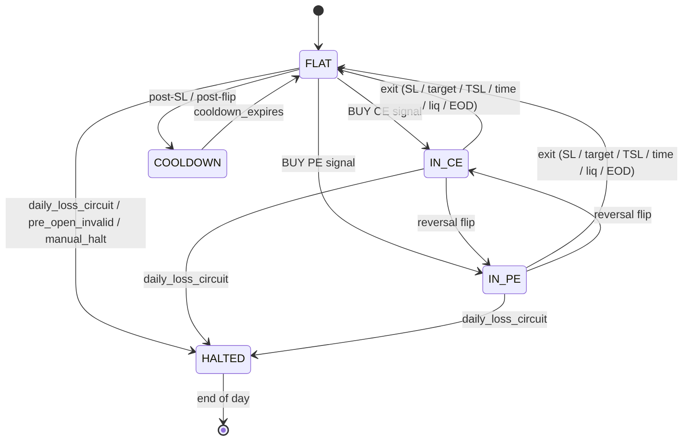
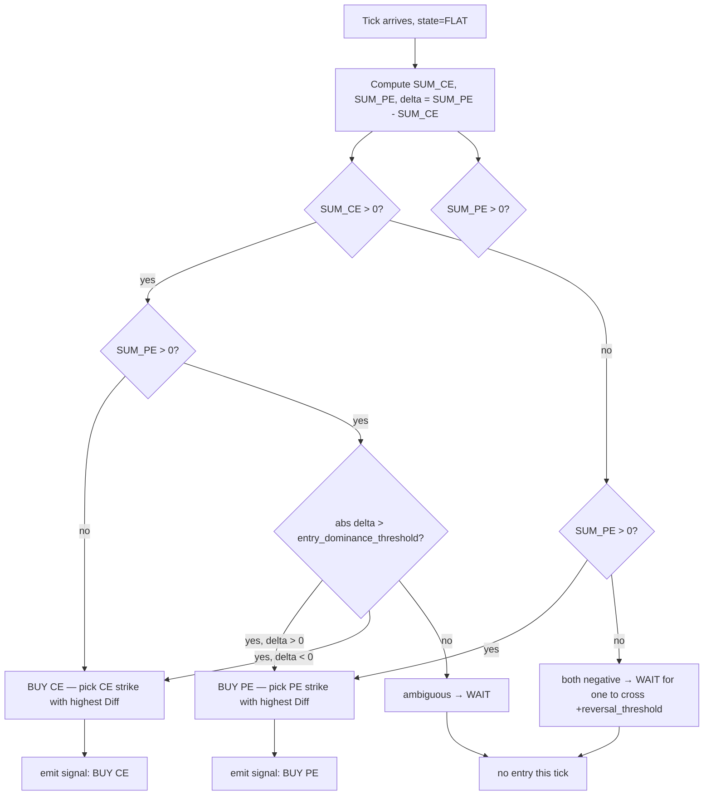
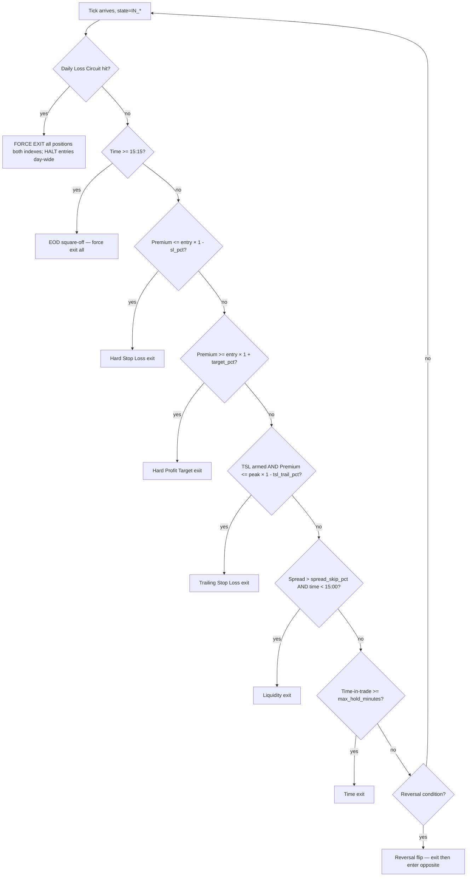

# Strategy & Execution — Premium-Diff Multi-Index Trading Bot

This document defines:

1. The trading thesis (the edge claim).
2. The per-index state machine and the continuous decision loop.
3. Strike-basket construction and the pre-open snapshot protocol.
4. Entry / exit / reversal-flip decision flowcharts.
5. Cooldowns, daily caps, and the full risk-control cascade.
6. The full order-execution flow from signal to cleanup, with broker-WS-driven monitoring.
7. The ΔPCR overlay (informational only; never on the hot path by default).
8. The complete configuration surface and tunable parameters.

This is the only authoritative source for strategy + execution. The lifecycle / boot / shutdown is covered in `Sequential_Flow.md`. The schema is covered in `Schema.md`. The broker SDK is covered in `backend/brokers/upstox/__init__.py`.

---

## 1. The Edge

**Pre-open positioning prices in overnight news.** When the market opens, premiums diverge from that baseline as flow comes in. We measure the divergence on a small basket of liquid ITM strikes and ride the side that moves first. We flip when the other side decisively overtakes.

Inputs that drive the strategy:

- **Pre-open premium snapshot** captured at 09:14:50 IST per basket strike (immutable for the day).
- **Live WebSocket tick stream** carrying current premium, bid, ask, volume per strike.
- **Spot LTP** for ATM tracking (used for the ΔPCR strike-set re-centering only).

Inputs we **do not** use on the hot path:

- **Open interest** — NSE refreshes OI every ~3 min; too slow for live entry/exit decisions. Used only by the optional ΔPCR overlay.
- **Greeks** — informative for dashboards, not used in decisions.
- **Historical candles** — unused at runtime; backtesting only.

---

## 2. Per-Index Specification

Both indexes run as **identical, independent strategy instances**. They share only:

- The global daily-loss circuit (across both).
- The order execution layer.
- The same broker connection.

Otherwise: separate state, separate basket, separate position, separate ΔPCR.

| Index | Exchange | Strike Step | Lot Size | Expiry Cadence | Reversal Threshold |
|---|---|---|---|---|---|
| **NIFTY 50** | NSE | 50 | 75 | Weekly (Tuesday) | ₹20 |
| **BANKNIFTY** | NSE | 100 | 35 | Monthly (last Tuesday) | ₹40 |

All instrument-specific values (strike step, lot size, current expiry token) are read live from the broker at startup via `UpstoxAPI.get_option_contracts(...)` → `nearest_expiry(...)`. The defaults above are for reference. Reversal thresholds are configurable per index.

---

## 3. Per-Index State Machine



| State | Meaning | Permitted actions |
|---|---|---|
| **FLAT** | No open position; ready to enter | Read ticks, evaluate entry decision tree |
| **IN_CE** | Holding a CE position | Evaluate exit cascade; evaluate reversal flip to PE |
| **IN_PE** | Holding a PE position | Evaluate exit cascade; evaluate reversal flip to CE |
| **COOLDOWN** | Just exited; lockout active | Read ticks (for telemetry) but emit no signals |
| **HALTED** | Day stopped (circuit / invalid / manual) | Emit no signals; existing position force-exited if circuit; idle until 15:15 EOD reset |

**Persistence**: state is in `strategy:{index}:state` (single STRING). On engine restart, the strategy re-reads it and resumes. `IN_CE` / `IN_PE` restart additionally reads `current_position_id` and consults Order Exec for the open trade's status.

---

## 4. Trading Basket and Subscription Range

### 4.1 The trading basket (locked at 09:15)

Six strikes per index, fixed for the day:

| Side | Strikes |
|---|---|
| **CE basket** | ATM, ATM−1step, ATM−2step (ITM calls; gain when index rises) |
| **PE basket** | ATM, ATM+1step, ATM+2step (ITM puts; gain when index falls) |

`ATM at 09:15 = round(spot / strike_step) × strike_step` using the spot LTP from the first tick at/after 09:15:00.

The basket **does not change** for the rest of the day, even if spot drifts. This is intentional: the diff signal is meaningful only when measured against the *same* strikes whose pre-open baseline we captured.

ITM-bias rationale:
- Higher delta (~0.55–0.85) → premium responds more 1:1 to spot.
- Tighter spreads → cleaner execution.
- Less time-decay shock vs OTM at intraday horizons.

### 4.2 Subscription range (ATM ± 6, dynamic re-centering)

| Range | Purpose |
|---|---|
| **Trading basket: ATM ± 2** | 6 strikes — the locked decision set |
| **ΔPCR set: ATM ± 2 (dynamic)** | 5 strikes — re-centers on spot drift |
| **Safety buffer: ±4 more strikes** | Absorbs intraday ATM drift without re-subscribing under load |
| **Total per index** | 13 CE + 13 PE = 26 contracts + 1 spot = 27 keys |
| **Total across both indexes** | 54 WS subscriptions |

Subscription happens at **09:14:00** so quotes are flowing before the 09:14:50 snapshot. The subscription manager keeps the window centered as spot moves: subscribe new edge strikes proactively, unsubscribe ones now too far out, never let the window drop below ATM ± 6.

### 4.3 Pre-open snapshot (09:14:50)

Per index, for each of the 6 trading-basket strikes, capture and persist as immutable baseline:

- `pre_open_premium` — last traded price in the pre-open session
- `bid` and `ask`
- `oi` (informational; not used in hot-path decisions)

For the ATM ± 2 ΔPCR set: capture baseline OI for both calls and puts (informational).

**Validation gate** (per index):
- If any of the 6 trading-basket strikes has `ts == 0` (no pre-open trade ever recorded for that contract) → **set `strategy:{index}:enabled = false` for the day**, alert WARN, and proceed without that index. The other index continues independently.
- This is the fail-closed behavior already mandated by `Sequential_Flow.md` §10.

---

## 5. The Continuous Decision Loop

The strategy runs one thread per index. Each thread blocks on the per-index tick stream `market:stream:tick:{index}` and runs this loop:

```python
state = read("strategy:{index}:state")          # FLAT | IN_CE | IN_PE | COOLDOWN | HALTED
basket = read("strategy:{index}:basket")        # locked 6 strikes
pre_open = read("strategy:{index}:pre_open")    # immutable baseline

for tick in tick_stream:
    if state == HALTED:
        continue                                # no action; just drain the stream

    if state == COOLDOWN:
        if cooldown_expired():
            state = FLAT
            persist(state)
        else:
            continue

    diffs = compute_diffs(tick, basket, pre_open)        # per-strike Δ vs baseline
    sum_ce, sum_pe = aggregate(diffs)
    delta = sum_pe - sum_ce                              # signed flip indicator
    persist_live_view(diffs, sum_ce, sum_pe, delta)

    if state == FLAT:
        signal = evaluate_entry(sum_ce, sum_pe, delta, diffs)
        if signal:
            emit_signal(signal)
            state = "ENTRY_PENDING"                       # transient; cleared by Order Exec
    else:                                                # IN_CE or IN_PE
        exit_signal = evaluate_exit_cascade(...)
        if exit_signal:
            emit_signal(exit_signal)
        else:
            flip_signal = evaluate_reversal(state, delta)
            if flip_signal:
                emit_signal(flip_signal)
```

Every signal is idempotent — keyed by `sig_id = sha256(index | tick_seq | side | strike | intent)`. Order Exec deduplicates on `sig_id` before submitting to the broker.

---

## 6. Entry Decision (when state = FLAT)



### 6.1 Entry rules in plain English

| Condition                                            | Action                                        |
| ---------------------------------------------------- | --------------------------------------------- |
| `SUM_CE > 0` AND `SUM_PE ≤ 0`                        | **BUY CE** on highest-Diff CE strike          |
| `SUM_PE > 0` AND `SUM_CE ≤ 0`                        | **BUY PE** on highest-Diff PE strike          |
| Both > 0 AND `\|delta\| > entry_dominance_threshold` | Enter dominant side (sign of delta)           |
| Both > 0 AND `\|delta\| ≤ entry_dominance_threshold` | **WAIT** — ambiguous                          |
| Both ≤ 0                                             | **WAIT** — both-negative recovery rule (§6.2) |

`entry_dominance_threshold` = same as the index's `reversal_threshold_inr` (₹20 NIFTY / ₹40 BANKNIFTY) by default. Configurable separately if needed.

### 6.2 Both-negative recovery

When both SUMs are below zero, neither side has shown positive divergence vs pre-open. The strategy waits. The first side whose SUM crosses **+reversal_threshold** above zero triggers an entry on that side. This filters out the early-session noise where premiums drift below pre-open due to spread widening or thin liquidity, then recover.

### 6.3 Strike pick within a basket

Among the 3 strikes of the chosen basket, pick the one with the **highest individual Diff in absolute rupee terms**. This is a measure of which strike is leading the move. (Volume- or delta-weighted alternatives are out of scope for v1.)

### 6.4 Entry freeze near close

From **15:10 to 15:15** (5-minute pre-EOD window): no new entries. Existing trades continue to be managed; everything force-exits at 15:15.

### 6.5 Daily entry cap

Per index per day:
- Max **8 entries** total (initial + post-cooldown re-entries + reversal flips).
- Max **4 reversal flips**.

Reaching either cap → state stays FLAT but no new signals emit for the rest of the day; existing trade (if any) still managed normally.

---

## 7. Exit Decision (when state = IN_CE or IN_PE)

Eight triggers, evaluated **every tick** in this strict priority order. The first to fire wins — others are ignored on that tick.



### 7.1 Exit triggers

| # | Trigger | Default | Condition |
|---|---|---|---|
| 1 | **Daily Loss Circuit** | −8% of capital | `cumulative_day_pnl ≤ −daily_loss_circuit_pct × trading_capital` |
| 2 | **EOD Square-Off** | 15:15 IST | `now ≥ session.eod_squareoff` |
| 3 | **Hard Stop Loss** | −20% of premium | `current_premium ≤ entry_premium × (1 − sl_pct)` |
| 4 | **Hard Profit Target** | +50% of premium | `current_premium ≥ entry_premium × (1 + target_pct)` |
| 5 | **Trailing Stop Loss** | armed at +15%, trails 5% off peak | `tsl_armed AND current_premium ≤ peak_premium × (1 − tsl_trail_pct)` |
| 6 | **Liquidity Exit** | spread > 5% of LTP | `(ask − bid) / ltp > spread_skip_pct` AND `now < 15:00` (don't trigger on EOD spread widening) |
| 7 | **Time Exit** | 25 min | `now − entry_time ≥ max_hold_minutes` |
| 8 | **Reversal Flip** | per-index threshold | see §8 |

### 7.2 TSL arming & peak tracking

The TSL is **disarmed at entry**. It arms once when premium first reaches `entry_premium × (1 + tsl_arm_pct)`. After arming, `peak_premium` is updated on every tick where `current_premium > peak_premium`. The TSL trigger fires when premium drops to `peak_premium × (1 − tsl_trail_pct)`.

State maintained in `strategy:{index}:position:{...}`:
- `tsl_armed` — bool
- `peak_premium` — float

These are read by Order Exec (the actual exit-evaluator) on every tick.

### 7.3 Liquidity exit safe window

Liquidity exit (trigger 6) is **suppressed in the last 15 minutes** of the session (after 15:00). EOD spreads naturally widen as participants exit; an automatic liquidity-exit cascade in the last 15 min would just amplify slippage. Force-exits at 15:15 are pure modify-only loops — they tolerate wide spreads.

---

## 8. Reversal Flip

A reversal is a single transactional intent: **exit current position AND enter opposite-side position** as one atomic plan. Order Exec executes it as a sequenced two-step (exit first, then entry, observably).

### 8.1 Trigger

Define `delta = SUM_PE − SUM_CE` (signed).

| Current state | Flip condition | Action |
|---|---|---|
| **IN_CE** | `delta > +reversal_threshold` | Exit CE, then enter PE on highest-Diff PE strike |
| **IN_PE** | `delta < −reversal_threshold` | Exit PE, then enter CE on highest-Diff CE strike |

### 8.2 Atomicity

```mermaid
sequenceDiagram
    autonumber
    participant St as Strategy
    participant Redis
    participant OE as Order Exec
    participant Br as Broker

    St->>St: tick: in IN_CE, delta > +threshold
    St->>Redis: emit single signal {intent: REVERSAL_FLIP, exit_pos_id, new_side, new_strike}
    OE->>Redis: XREADGROUP signals
    OE->>Br: Phase A — submit exit limit (modify-only loop)
    Br-->>OE: exit FILLED
    OE->>Br: Phase B — submit entry limit (entry monitor loop)
    alt entry FILLED
        OE->>Redis: cleanup old position; create new position {state=IN_PE}
        OE->>Redis: persist strategy:{idx}:state = IN_PE
        OE->>Redis: trigger COOLDOWN for reversal_cooldown_seconds
    else entry abandoned (drift > chase_ceiling / open_timeout)
        OE->>Redis: cleanup old position
        OE->>Redis: persist strategy:{idx}:state = COOLDOWN
        OE->>Redis: alert WARN "flip degraded to exit-only"
    end
```

Strategy never emits a *new* entry while a flip is in flight. The signal is one logical unit; Order Exec owns the two-phase execution and the final state transition.

### 8.3 Reversal cooldown

After a successful flip OR a degraded flip-to-flat, the index enters **COOLDOWN** for `reversal_cooldown_seconds` (default 90s). No new signals during cooldown.

### 8.4 Reversal cap

Max **4 reversal flips per index per day**. The 5th flip condition is ignored (the position is held to its other exits).

---

## 9. Cooldowns Summary

| Cooldown | Trigger | Duration | What's blocked |
|---|---|---|---|
| **Post-SL cooldown** | Hard SL exit | 60s | New entries on this index |
| **Post-reversal cooldown** | Reversal flip (success or degraded) | 90s | New entries AND new flips on this index |
| **Post-target / TSL / time exit** | Normal exits | None | Re-entry allowed immediately on next valid signal |

Cooldown state lives in `strategy:{index}:cooldown_until_ts`. The state machine reads it once per tick and transitions COOLDOWN → FLAT when expired.

---

## 10. Order Execution Flow (full path: signal → cleanup)

This is the engine-side path. Strategy emits one signal; Order Exec carries it through six stages.

```mermaid
sequenceDiagram
    autonumber
    participant St as Strategy
    participant SR as orders:stream:signals
    participant OE as Order Exec worker
    participant BR as Broker REST (v3 HFT)
    participant PWS as Portfolio WS (broker)
    participant PG as Postgres

    St->>SR: XADD signal
    OE->>SR: XREADGROUP signal
    Note over OE: STAGE A — pre-trade gates
    OE->>OE: read trading_active, kill_switch, daily_loss_circuit, allocator
    OE->>OE: spread filter, depth check, circuit-limit check
    alt any gate fails
        OE->>SR: XADD orders:stream:rejected_signals
        OE->>PG: INSERT trades_rejected_signals
        Note over OE: STOP — no order placed
    end

    Note over OE: STAGE B — entry submit
    OE->>OE: status = ENTRY_SUBMITTING; price = best_ask + buffer
    OE->>BR: place_order (DAY LIMIT, slice=true)
    BR-->>OE: order_id
    OE->>OE: status = ENTRY_OPEN

    Note over OE: STAGE C — entry monitor (event-driven via portfolio WS)
    loop until FILLED or abandoned
        PWS-->>OE: order update {filled_qty, avg_price, status}
        OE->>OE: re-evaluate ask drift
        alt FILLED
            OE->>OE: status = ENTRY_FILLED
        else PARTIAL + brief wait elapsed
            OE->>BR: cancel remainder; continue with filled qty
        else drift > drift_threshold AND drift < chase_ceiling
            OE->>BR: modify_order (new price = best_ask + buffer)
        else drift >= chase_ceiling OR open_timeout
            OE->>BR: cancel_order
            OE->>OE: ABANDON signal
        end
    end

    Note over OE: STAGE D — exit eval (tick-driven)
    loop until exit triggered
        OE->>OE: read current premium, evaluate exit cascade (§7)
        alt trigger fires
            break
        end
    end

    Note over OE: STAGE E — exit submit (modify-only loop)
    OE->>OE: status = EXIT_SUBMITTING; price = best_bid - buffer
    OE->>BR: place_order (SELL DAY LIMIT)
    loop until FILLED  (cannot abandon)
        PWS-->>OE: order update
        alt FILLED
            break
        else drift
            OE->>BR: modify_order (new price = best_bid - buffer)
        end
    end

    Note over OE: STAGE F — reporting + cleanup
    OE->>OE: build closed_position report (entry, exit, fees via UpstoxAPI.get_brokerage)
    OE->>PG: INSERT trades_closed_positions
    OE->>OE: cleanup Redis (cleanup_position.lua atomic)
    OE->>St: order_events stream emits CLOSED event
    St->>St: state -> FLAT (or COOLDOWN if SL / reversal)
```

### 10.1 Pre-trade gates (Stage A)

All must pass before placing the order:

1. `system:flags:trading_active == "true"`.
2. `kill_switch_status[NSE_FO].kill_switch_enabled == false`.
3. `system:flags:daily_loss_circuit_triggered == "false"`.
4. `system:flags:engine_up:order_exec == "true"` (self-check).
5. **Spread filter**: `(best_ask − best_bid) / ltp ≤ spread_skip_pct`.
6. **Depth check**: `best_ask_qty ≥ intended_lots × lot_size`. If insufficient, reduce lots; if reducing below `min_lots = 1`, abandon.
7. **Circuit-limit check**: candidate price must lie within the broker-reported lower/upper circuit (sanity check; rare violation).

Any failure: signal is rejected, logged to `orders:stream:rejected_signals` and Postgres `trades_rejected_signals`.

### 10.2 Order pricing

| Side | Limit price |
|---|---|
| BUY | `best_ask + buffer_inr` |
| SELL | `best_bid − buffer_inr` |

Default `buffer_inr = ₹2`. Aggressive enough to fill most of the time, conservative enough to avoid overpaying on the spread.

LTP is **never** used to place orders.

### 10.3 Entry monitor (Stage C)

Entry monitor is **event-driven** on broker portfolio WS, not poll-based. The Portfolio Streamer (`UpstoxAPI.portfolio_streamer(...)`) pushes order-update events as broker state changes. Order Exec consumes them and reacts.

| Broker state | Action |
|---|---|
| `FILLED` | Move to Stage D (exit eval) |
| `PARTIAL` (partial fill, rest pending) | Wait `partial_grace_sec` (default 3s); if rest still pending, cancel remainder, continue with filled qty |
| `OPEN` AND ask drifted < `drift_threshold` | Hold |
| `OPEN` AND `drift_threshold` ≤ drift < `chase_ceiling` | Modify limit to new ask + buffer |
| `OPEN` AND drift ≥ `chase_ceiling` | Cancel, abandon signal |
| `OPEN` AND no movement for `open_timeout_sec` | Cancel, abandon signal |
| `REJECTED` | Refresh quote, retry up to `max_retries`, then abandon |

Defaults: `drift_threshold = ₹3`, `chase_ceiling = ₹15`, `open_timeout_sec = 8`, `max_retries = 2`, `partial_grace_sec = 3`.

### 10.4 Exit submit (Stage E) — modify-only

Exit orders **never** abandon. The position MUST close. The loop:

1. Place SELL DAY LIMIT at `best_bid − buffer_inr`.
2. Wait for fill via portfolio WS.
3. If `OPEN` and bid has drifted, **modify** the limit toward the new bid — do not cancel.
4. If `REJECTED`, refresh quote and retry place.
5. Continue until `FILLED`.

In the last 15 min before EOD (after 15:00), the buffer is widened to `eod_buffer_inr` (default `₹5`) to fill faster against thin EOD books.

### 10.5 Cleanup atomicity

Stage F runs a single Lua script `cleanup_position.lua` that atomically:
- Deletes `orders:positions:{pos_id}`, `orders:orders:{order_id}` for both legs, `orders:status:{pos_id}`, `orders:signals:{sig_id}`.
- Removes `pos_id` from `orders:positions:open` and `orders:positions:open_by_index:{index}`.
- Adds `pos_id` to `orders:positions:closed_today`.
- Updates `orders:allocator:open_count[index]` and `orders:allocator:open_symbols`.

Postgres `INSERT trades_closed_positions` runs BEFORE the Lua cleanup. If the INSERT fails, the report is buffered in `orders:reports:pending` and retried by Background; cleanup waits for the buffer to clear (or proceeds with WARN after 30s).

---

## 11. Risk Management Summary

| Layer | Rule | Default |
|---|---|---|
| **Per-trade SL** | hard exit at premium drop | −20% |
| **Per-trade target** | hard exit at premium rise | +50% |
| **Trailing SL** | armed and trails | armed at +15%, trails 5% off peak |
| **Time-in-trade** | force exit after duration | 25 min |
| **Liquidity exit** | spread filter | > 5% of LTP (suppressed last 15min) |
| **Daily loss circuit** | flatten + halt across both indexes | −8% of capital |
| **EOD square-off** | force exit | 15:15 IST |
| **Concurrent positions per index** | max | 1 |
| **Concurrent positions total** | max | 2 (one per index) |
| **Reversal threshold** | per index INR | NIFTY ₹20 / BANKNIFTY ₹40 |
| **Both-negative wait** | both SUMs < 0 → no entry until one crosses +threshold | yes |
| **Entry dominance threshold** | both SUMs > 0 → require gap | same as reversal_threshold |
| **Post-SL cooldown** | block re-entry | 60s |
| **Post-reversal cooldown** | block flips + entries | 90s |
| **Daily entry cap (per index)** | max entries | 8 |
| **Daily reversal cap (per index)** | max flips | 4 |
| **Entry freeze pre-EOD** | no new entries | 15:10 → 15:15 |

---

## 12. ΔPCR Overlay (Informational)

The ΔPCR (change in put-call OI ratio) overlay is **kept for the dashboard but disabled on the hot path by default**. Its data refresh cadence (NSE OI updates every 3 min) is too slow for entry/exit decisions.

### 12.1 Computation (per index, every 3 min from 09:18)

1. **Re-center the strike set**: `ATM = round(spot / strike_step) × strike_step`. Strike set = `{ATM−2, ATM−1, ATM, ATM+1, ATM+2} × step`.
2. **Compute ΔOI per strike**:
   - If strike was in previous set: `ΔOI = current_OI − previous_OI`.
   - If strike is new (just moved into set): `ΔOI = current_OI`.
   - If strike has exited the set: ignore for this interval.
3. **Aggregate**:
   ```
   Total_ΔPut_OI       = Σ ΔPut_OI over the 5 current strikes
   Total_ΔCall_OI      = Σ ΔCall_OI over the 5 current strikes
   Interval_ΔPCR       = Total_ΔPut_OI / Total_ΔCall_OI
   Cumulative_ΔPCR     = Σ Interval_ΔPut_OI / Σ Interval_ΔCall_OI  (since session start)
   ```

### 12.2 Reading

| Cumulative_ΔPCR | Reading |
|---|---|
| > 1.2 | Strong fresh put writing → bullish bias |
| 0.8 – 1.2 | Neutral |
| < 0.8 | Strong fresh call writing → bearish bias |

### 12.3 Operating modes (per index)

| Mode | Behavior | Default |
|---|---|---|
| **1 — Display Only** | Dashboard only; no effect on signals | ✅ |
| **2 — Soft Veto** | Entry contradicting ΔPCR direction → 50% reduced position size | off |
| **3 — Hard Veto** | Entry contradicting ΔPCR direction → skip the trade | off |

Modes 2 and 3 are wired but disabled by default. Enabling either places ΔPCR on the hot path; given the 3-min cadence vs sub-second tick path, the gating is *already stale* by the time it acts. The user should turn these on only after observing live behavior and deciding the slow signal helps.

---

## 13. Daily Lifecycle (cross-reference)

The strategy engine boots, runs, and shuts down according to `Sequential_Flow.md`. Here is the strategy-specific timeline:

| Time | Event |
|---|---|
| 09:14:00 | Data Pipeline subscribes broker WS to ATM±6 across both indexes (54 keys). |
| 09:14:50 | Strategy/idx captures pre-open snapshot. Validates: any zero-ts strike → opt-out for the day. |
| 09:14:50 | Background captures ΔPCR baseline OI per index. |
| 09:15:00 | Market open. ATM at 09:15 LOCKED. Trading basket built and persisted. |
| 09:15:10 | Phase 2 continuous decision loop begins (per index). |
| 09:18:00, 09:21:00, … | Background ΔPCR thread computes every 3 min until 15:12. |
| 15:10:00 | **Entry freeze** begins. No new entries; existing trades managed normally. |
| 15:15:00 | EOD square-off event fires. Order Exec force-exits all open positions. |
| 15:30:00 | Market close. Strategy thread transitions to WAITING_NEXT_DAY. |
| 15:45:00 | Graceful shutdown: strategy thread drains tick stream and exits. |

---

## 14. Configuration Surface

```yaml
indexes:
  nifty50:
    enabled:                       true
    exchange:                      NSE
    strike_step:                   50
    lot_size:                      75              # refreshed daily from instruments
    expiry_preference:             "nearest"       # nearest expiry >= today
    subscription_range:            6               # ATM ± N strikes
    trading_basket_range:          2               # ATM ± N trading strikes
    delta_pcr_range:               2               # ATM ± N for ΔPCR
    reversal_threshold_inr:        20
    entry_dominance_threshold_inr: 20              # default to reversal_threshold_inr
    target_pct:                    0.50
    sl_pct:                        0.20
    tsl_arm_pct:                   0.15
    tsl_trail_pct:                 0.05
    max_hold_minutes:              25
    fixed_lots:                    1
    delta_pcr_mode:                1               # 1=display, 2=soft veto, 3=hard veto
    post_sl_cooldown_sec:          60
    post_reversal_cooldown_sec:    90
    max_entries_per_day:           8
    max_reversals_per_day:         4

  banknifty:
    enabled:                       true
    exchange:                      NSE
    strike_step:                   100
    lot_size:                      35
    expiry_preference:             "nearest"
    subscription_range:            6
    trading_basket_range:          2
    delta_pcr_range:               2
    reversal_threshold_inr:        40
    entry_dominance_threshold_inr: 40
    target_pct:                    0.50
    sl_pct:                        0.20
    tsl_arm_pct:                   0.15
    tsl_trail_pct:                 0.05
    max_hold_minutes:              25
    fixed_lots:                    1
    delta_pcr_mode:                1
    post_sl_cooldown_sec:          60
    post_reversal_cooldown_sec:    90
    max_entries_per_day:           8
    max_reversals_per_day:         4

execution:
  buffer_inr:                      2               # ₹2 for entry/exit limit pricing
  eod_buffer_inr:                  5               # widened buffer after 15:00
  spread_skip_pct:                 0.05            # 5% LTP-relative spread filter
  drift_threshold_inr:             3               # entry: modify if ask drifts ≥ this
  chase_ceiling_inr:               15              # entry: abandon if ask drifts ≥ this
  open_timeout_sec:                8               # entry: abandon if no fill within
  partial_grace_sec:               3               # cancel partial-fill remainder after
  max_retries:                     2               # rejected order retry count
  liquidity_exit_suppress_after:   "15:00"         # disable liquidity exit after this

global_risk:
  daily_loss_circuit_pct:          0.08
  max_concurrent_positions:        2
  trading_capital_inr:             200000

session:
  market_open:                     "09:15"
  pre_open_snapshot:               "09:14:50"
  ws_subscribe_at:                 "09:14:00"
  delta_pcr_first_compute:         "09:18"
  delta_pcr_interval_minutes:      3
  entry_freeze:                    "15:10"
  eod_squareoff:                   "15:15"
  market_close:                    "15:30"

# Default mode at deployment is paper. Live requires explicit operator opt-in.
mode:                              "paper"         # or "live"
```

---

## 15. Test Scenarios (property-based)

These are the invariants every code change must preserve. CI runs them.

| # | Property | Test |
|---|---|---|
| 1 | Pre-open snapshot is immutable | After 09:14:50, attempting to write `strategy:{idx}:pre_open` raises |
| 2 | Basket is locked at 09:15 | Spot drift after 09:15 does NOT change `strategy:{idx}:basket` |
| 3 | Per-index opt-out works | Force one strike's pre-open ts=0 → that index goes `enabled=false`, OTHER index continues |
| 4 | No entry during cooldown | State=COOLDOWN, fire any tick → no signal emitted |
| 5 | No entry during entry freeze | Time ≥ 15:10, fire any tick → no entry; only exits/flips emit |
| 6 | Daily entry cap enforced | After 8 entries on an index, 9th valid signal is suppressed |
| 7 | Daily reversal cap enforced | After 4 flips, 5th flip condition ignored |
| 8 | Exit priority cascade | Multiple triggers same tick → highest-priority wins |
| 9 | Exits never abandon | Force REJECTED on exit → keeps modify-looping until filled |
| 10 | Reversal flip atomicity | Exit fails to fill → entry NOT submitted; state stays IN_* |
| 11 | Idempotent signals | Re-emit same sig_id → Order Exec dedupes; no double-fill |
| 12 | Daily loss circuit halts both indexes | Trigger circuit → all open positions force-exit; no new signals on either index |
| 13 | OI never on hot path | Grep test: `oi` never appears in strategy decision-tree functions |
| 14 | Engine restart resumes correctly | Kill strategy mid-trade → restart → resumes IN_* state with same position |
| 15 | Pre-open zero-quote is fail-closed | Mock 1 strike with ts=0 → that index's `enabled=false` for the day |

---

## 16. Open Decisions

| # | Decision | Default | Alternative |
|---|---|---|---|
| 1 | Drop Phase 1 first-tick entry | YES (drop) | Keep as optional config flag |
| 2 | Entry-dominance gating when both SUMs > 0 | Use `reversal_threshold_inr` as the gap | Separate parameter (already wired as `entry_dominance_threshold_inr`) |
| 3 | Cooldown durations | 60s post-SL, 90s post-reversal | Configurable; tune from live data |
| 4 | Daily entry cap | 8 entries / 4 reversals per index | Lower for live mode initial weeks |
| 5 | Liquidity exit suppression window | After 15:00 | Configurable boundary |
| 6 | ΔPCR default mode | 1 (display) | Mode 2 or 3 only after live observation |
| 7 | Partial fill grace period | 3s before canceling remainder | 5s if execution feedback shows partials are normal |
| 8 | EOD buffer widening | ₹5 after 15:00 | ₹3 / ₹10 — tune from EOD slippage data |

Until signed off, the defaults apply.

---

## 17. Scope

**In scope:**
- NIFTY 50 + BANKNIFTY weekly/monthly options.
- Premium-diff momentum engine with reversal flips.
- ΔPCR overlay (informational by default).
- DAY-limit execution with broker-WS-driven entry monitor and modify-only exit.
- Per-trade risk caps + global daily-loss circuit.
- Paper + live modes (default paper).
- Single concurrent position per index, fixed lot sizing, single user.
- Cooldowns, daily caps, entry freeze.

**Out of scope (v1):**
- SENSEX, single-stock options, multi-strategy concurrency.
- ML signal weighting, regime detection.
- Multi-tenant deployment.
- Hedging legs / spreads / combos.
- Index-futures hedging.
- Volume- or delta-weighted strike pick (current is pure highest-Diff).
- Variable position sizing based on premium / IV.

---

## 18. Summary

The strategy trades a fixed locked-at-09:15 basket of six ITM-biased options per index across NIFTY 50 and BANKNIFTY. Direction is decided by which side's summed premium-diff vs the pre-open baseline is positive and dominant; the engine flips when the opposite side decisively overtakes by a per-index INR threshold. Every tick triggers an entry, hold, exit, or flip evaluation through an explicit 5-state machine (FLAT, IN_CE, IN_PE, COOLDOWN, HALTED). Eight exit triggers in strict priority govern position close; exits are modify-only and cannot abandon. Reversal flips are atomic single-signals executed by Order Exec as exit-then-entry with a 90s cooldown after. Cooldowns (60s post-SL, 90s post-flip) and daily caps (8 entries / 4 flips per index) damp overtrading. ΔPCR is computed every 3 min for the dashboard but does not gate decisions by default — NSE OI cadence is too slow for the hot path.
