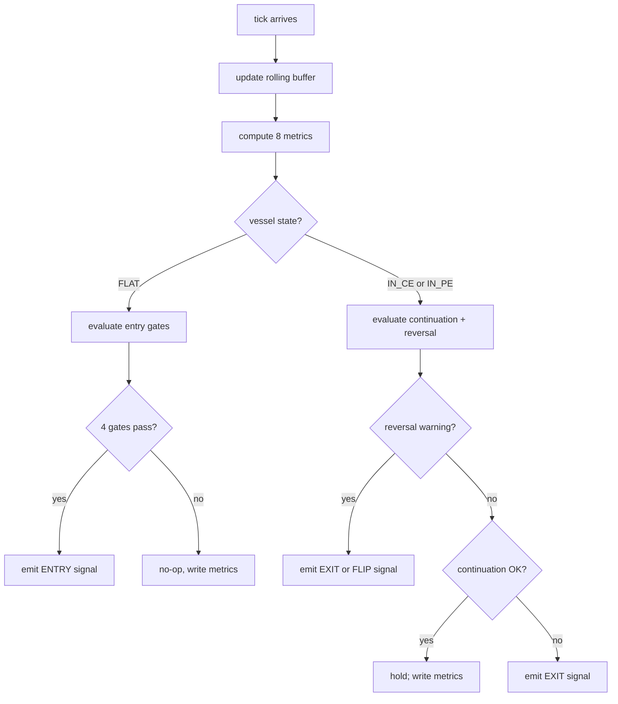
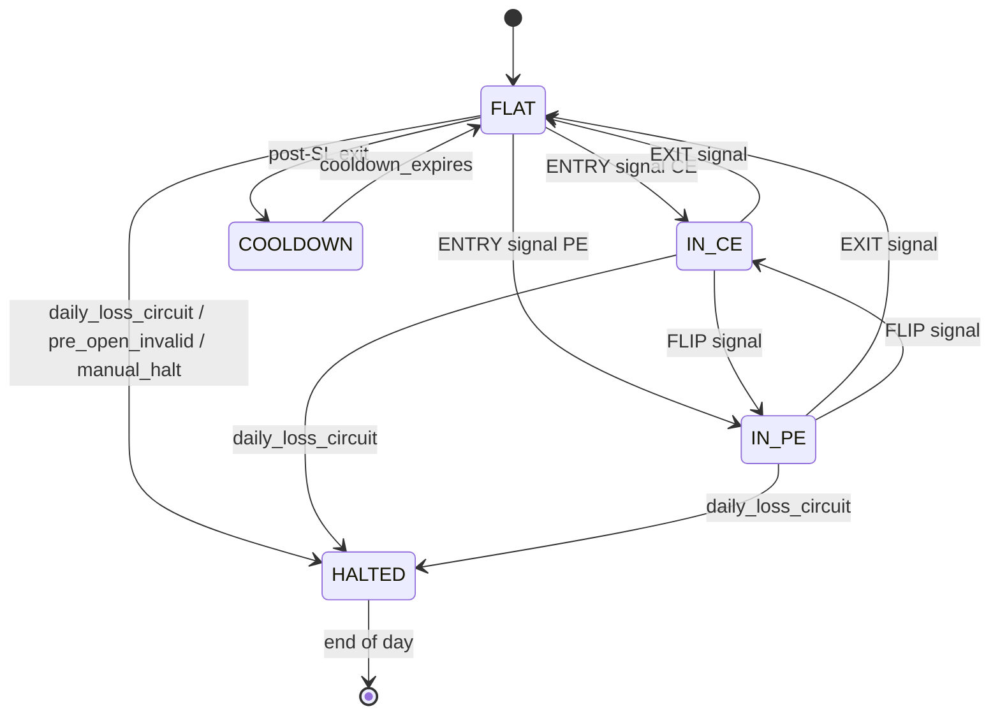

# Strategy Engine — Bid/Ask Imbalance Order-Flow

This document specifies the strategy engine.

Sections:

1. Trading thesis
2. Engine architecture — one process, N strategy vessels, async event-driven
3. Strike basket construction + dynamic ATM management
4. The eight atomic metrics that drive every decision
5. Decision logic — entry gates, continuation, reversal warning
6. Time-of-day windowing
7. Module layout
8. Schema (Redis + Postgres)
9. Configuration
10. Logging, observability, live display

Lifecycle / boot / shutdown: `Sequential_Flow.md`. Broker SDK: `backend/brokers/upstox/__init__.py`. Cross-engine plumbing: `HLD.md`.

---

## 1. Trading Thesis

The strategy reads the resting order book (bid/ask quantities at five depth levels) on a basket of strikes around ATM. Order book state updates arrive on every quote change, including when no trade prints. The strategy fires when imbalance, spread, ask-wall state, aggressor side, and tick-direction streak all align in the same direction at the same moment.

**Inputs used on the hot path:**

- **Per-strike imbalance** — `ΣBidQty / ΣAskQty` across the 5 depth levels.
- **Spread** — `best_ask − best_bid` for liquidity-quality gating.
- **Ask wall** — `best_ask_qty > 5 × best_bid_qty` plus its history (HOLDING / ABSORBING / REFRESHING).
- **Aggressor** — LTP near best ask (buyers lifting offers) or near best bid (sellers hitting bids).
- **Tick speed** — N consecutive upticks (or downticks) within `window_ms`.
- **Cumulative imbalance** — `Σ(BidQty)/Σ(AskQty)` aggregated across all CE strikes; symmetric for PE.
- **Net pressure** — `cum_ce_imbalance − cum_pe_imbalance`. Single composite for direction.
- **Quality score** — 0–10 across 5 conditions (§4.8); gates entry size + entry permission.

**Inputs not used on the hot path:**

- **Open interest** — NSE refreshes OI ~3 min, too slow for tick-level decisions.
- **Greeks** — informational only.
- **Historical candles** — backtesting only.

**Constraint baked into expectations:** Upstox retail depth feed carries 50–200 ms lag. The architecture is event-driven, not polled, end to end, to keep added vessel latency under 1 ms on top of feed latency.

---

## 2. Engine Architecture

### 2.1 One process, N vessels

The strategy engine (`pcr-strategy`) is a single Python process running a single asyncio event loop. Inside that loop, **N strategy vessels** run concurrently as cooperating coroutines. Each vessel is one `(strategy_id, instrument_id)` pair with its own config, its own basket, its own state, and its own decision loop.

```
pcr-strategy process (single asyncio event loop, uvloop)
├── tick_subscriber_task         ← Redis pub/sub on tick.{token}, fans dirty flags
├── vessel_bid_ask_imbalance_nifty50      ← awaits dirty.set()
├── vessel_bid_ask_imbalance_banknifty    ← awaits dirty.set()
├── (future) vessel_bid_ask_imbalance_sensex
├── (future) vessel_some_new_strategy_nifty50    ← same instrument, different strategy = no problem
├── signal_publisher_task        ← drains signal queue → strategy:stream:signals
└── health_heartbeat_task        ← writes heartbeat every 5 s per vessel
```

The engine runs two vessels by default (one per index, both running the bid/ask imbalance strategy). Adding a third strategy on the same instrument, or the same strategy on SENSEX, is a config change — not a code change.

### 2.2 Why async, not threads

- **Idle vessels consume zero CPU.** A vessel with no pending tick suspends on `await dirty.wait()` and is parked at the kernel level. The OS schedules it back when the event arrives.
- **No locks, no race conditions.** Cooperative multitasking on a single thread eliminates the entire class of concurrency bugs.
- **Shared market data is read from Redis on every evaluation.** No in-process state crosses vessel boundaries. Vessels are fully independent — adding, removing, or crashing one cannot affect siblings.
- **Compute frequency is naturally bounded by compute time itself.** Eval takes ~0.5–1 ms. If 100 ticks land in 1 s, the vessel runs ~100 evals on the freshest state per tick batch, with multiple ticks coalesced into one eval whenever they overlap with an in-progress compute.

### 2.3 Tick-driven evaluation with implicit coalescing

Every vessel uses this loop:

```
asyncio.Event flag = "dirty"

on tick notification (pub/sub from data-pipeline):
    dirty.set()                  # idempotent

vessel loop:
    while True:
        await dirty.wait()       # blocks at 0% CPU when idle
        dirty.clear()            # reset BEFORE reading state
        snapshot = read all monitored tokens from Redis
        update rolling buffer (vessel-local memory)
        decision = evaluate(snapshot, buffer)
        if decision: emit signal
```

**No artificial floor**, no 200 ms timer, no polling. Compute fires the moment a tick arrives. If multiple ticks arrive while compute is running, they all set the (already true) flag — the next loop iteration picks up the freshest state in one read. Coalescing happens for free.

**Order-book latency is dominated by the broker (50–200 ms). Vessel adds <1 ms.**

### 2.4 Multi-vessel data sharing

The vessels do *not* share in-process state with each other. The only shared resource is the WebSocket subscription set, and that is owned by `pcr-data-pipeline`. The data path is:

```
broker WS  →  pcr-data-pipeline  →  Redis (option_chain, depth, spot)
                                          ↓
                                          ↓  PUBLISH tick.{token}
                                          ↓
            ┌─────────────────────────────┼─────────────────────────────┐
            ↓                             ↓                             ↓
       vessel A reads               vessel B reads                vessel C reads
       (NIFTY)                       (BANKNIFTY)                  (SENSEX)
```

The data-pipeline is responsible for ensuring that all tokens any vessel needs are subscribed (union of vessel basket sets). The vessels themselves never talk to the broker.

---

## 3. Strike Basket + Dynamic ATM

### 3.1 Pre-open basket

At engine startup (08:00 IST, before market open), each vessel:

1. Loads its instrument's strike step + lot size from broker via `UpstoxAPI.get_option_contracts(...)`.
2. Picks the nearest expiry (weekly NIFTY / monthly BANKNIFTY) using `nearest_expiry(...)`.
3. Reads spot LTP, computes initial ATM = round(spot / step) × step.
4. Builds the initial basket of N CE strikes + N PE strikes around ATM (default N=5; configurable per instrument).
5. Pushes the union of basket tokens to `market_data:subscriptions:desired` so the data-pipeline subscribes them.
6. Waits for the data-pipeline to confirm all basket tokens are first-framed.

### 3.2 Dynamic ATM shift (every tick)

The vessel's basket is **not** locked at pre-open. On every spot tick the vessel checks:

```
new_atm = round(current_spot / strike_step) * strike_step
if new_atm != current_atm:
    add_strikes = new_atm-side strikes not yet in basket
    drop_strikes = old basket strikes more than N steps from new_atm
    push add_strikes to market_data:subscriptions:desired
    remove drop_strikes from market_data:subscriptions:desired
    update vessel's monitored basket
    log basket shift event
```

The data-pipeline reconciles its WS subscription set whenever `desired` changes. Newly added strikes start streaming within ~1 s. Dropped strikes stop streaming and are released.

**Strike step + basket size per instrument:**

| Instrument | Strike Step | Normal Basket | Expiry-Day Basket |
|---|---|---|---|
| NIFTY 50 | 50 | ATM ± 5 | ATM ± 7 |
| BANKNIFTY | 100 | ATM ± 5 | ATM ± 7 to ± 10 |
| SENSEX (future) | 100 | ATM ± 3 | ATM ± 5 to ± 7 |

Basket size is configurable. The expiry-day expansion is automatic when `expiry == today`.

### 3.3 Thrash protection

ATM shift triggers basket churn. To prevent rapid back-and-forth on a strike-boundary chop:

- A shift is committed only if `|spot - last_shift_spot| ≥ strike_step` (already implied above).
- After a shift, the next shift is allowed only after a 5-second hysteresis window.

This is a config knob, not hardcoded.

---

## 4. The Eight Atomic Metrics

Every decision is built from these eight metrics. Each is computed in its own module (Section 8).

### 4.1 Per-strike imbalance ratio

```
imbalance(strike) = ΣBidQty(strike) / ΣAskQty(strike)
```

Σ is the sum across the depth levels exposed by the broker (typically 5). Computed for every strike in the basket on every tick that touches that strike.

| Range | Classification |
|---|---|
| > 1.30 | Strong Buyers |
| 1.10 – 1.30 | Moderate Buyers |
| 0.90 – 1.10 | Neutral |
| 0.70 – 0.90 | Moderate Sellers |
| < 0.70 | Strong Sellers |

### 4.2 Spread

```
spread(strike) = best_ask_price - best_bid_price
```

Per-instrument thresholds:

| Instrument | Good | Moderate | Avoid Entry |
|---|---|---|---|
| NIFTY 50 | ≤ 0.50 | 0.50 – 1.00 | > 1.00 |
| BANKNIFTY | ≤ 1.50 | 1.50 – 3.00 | > 3.00 |
| SENSEX | ≤ 1.00 | 1.00 – 2.00 | > 2.00 |

### 4.3 Ask wall detection

```
ask_wall_present(strike) = (best_ask_qty > 5 × best_bid_qty)
```

Three sub-states inferred from the rolling buffer (last ~10 ticks for that strike):

- **HOLDING** — wall_qty has not decreased over the last 5 ticks. Acts as resistance; do not enter aggressively.
- **ABSORBING** — wall_qty is monotonically decreasing AND LTP is near ask AND bid_qty is rising. High-conviction breakout signal.
- **REFRESHING** — wall_qty resets to ~original size after each absorption attempt. Hidden algorithmic seller; *stronger* than HOLDING. Hard exit signal for any in-flight CE position on this strike.

### 4.4 LTP aggressor detection

```
if LTP >= best_ask - tolerance:  aggressive_buying = True
if LTP <= best_bid + tolerance:  aggressive_selling = True
```

Tolerance is `0.10` INR by default, instrument-overrideable.

### 4.5 Tick speed (consecutive direction)

Maintain a per-strike rolling buffer of the last 10 ticks (LTP, ts). Compute:

```
consecutive_upticks = max k such that LTP[-1] > LTP[-2] > ... > LTP[-k]
                                    AND ts[-1] - ts[-k] <= 1000 ms
consecutive_downticks = symmetric
```

`strong_momentum_up = (consecutive_upticks >= 3)` and similarly for down.

### 4.6 Cumulative CE / PE imbalance

```
cum_ce_imbalance = Σ(BidQty across all CE strikes in basket) / Σ(AskQty across all CE strikes)
cum_pe_imbalance = Σ(BidQty across all PE strikes in basket) / Σ(AskQty across all PE strikes)
```

This is the per-side aggregate. Smooths single-strike noise.

### 4.7 Net pressure

```
net_pressure = cum_ce_imbalance - cum_pe_imbalance
```

The composite directional reading.

| Range | Interpretation | Trade Direction |
|---|---|---|
| > +0.50 | Bullish dominance | CE BUY eligible |
| -0.20 to +0.20 | Neutral | No entry |
| < -0.50 | Bearish dominance | PE BUY eligible |
| Rapid collapse | Reversal risk | Tighten stops on existing positions |

The `±0.20 to ±0.50` band is "developing" — no entry, but reduce in-trade aggression.

### 4.8 Execution quality score (0–10)

Computed only when a directional candidate exists (i.e., `|net_pressure| > 0.50` and no holding ask wall on the chosen side).

| Condition | Points |
|---|---|
| Spread within "Good" range | +2 |
| Imbalance on chosen-side dominant strike > 1.30 | +2 |
| Ask wall on chosen side ABSENT or ABSORBING | +2 |
| 3+ consecutive upticks (CE) or downticks (PE) on chosen-side dominant strike within 1 s | +2 |
| LTP near ask (CE) or near bid (PE) on chosen-side dominant strike | +2 |
| **Maximum** | **10** |

Score interpretation:

| Score | Action |
|---|---|
| 8 – 10 | Aggressive entry — market order or near-ask limit |
| 5 – 7 | Moderate entry — limit at mid; 50% of normal qty |
| < 5 | No entry — insufficient confirmation |

---

## 5. Decision Logic

### 5.1 Per-tick decision flow



Every tick produces a logged decision event, even if the action is `NO_OP`. A vessel that is alive writes decision telemetry every tick; if the `last_decision_ts` for a vessel goes stale during LIVE phase, the health engine flags it red.

### 5.2 Entry — the 4-gate sequence

A FLAT vessel checks gates in order. Failing any gate aborts the entry attempt.

```
Gate 1 — Direction
    if abs(net_pressure) <= 0.50 → no entry
    side = CE if net_pressure > 0.50 else PE

Gate 2 — Ask Wall (CE entry) / Bid Wall (PE entry)
    inspect chosen-side dominant strike (highest imbalance)
    if wall is HOLDING or REFRESHING → no entry
    if wall is ABSORBING → proceed; this is bullish
    if no wall → proceed

Gate 3 — Spread
    spread on chosen strike must be in "Good" range
    if "Moderate" → reduce qty by 50% (passes but flagged)
    if "Avoid" → no entry

Gate 4 — Quality Score
    score = compute_score(side, chosen_strike)
    if score < threshold_for_current_time_window → no entry
    if score in 5-7 → enter half-size, limit at mid
    if score in 8-10 → enter full-size, market or near-ask
```

The gate evaluations all read from the same metrics already computed in step 4.x — no extra computation.

### 5.3 Continuation logic (in-trade)

When the vessel is `IN_CE` or `IN_PE`, every tick re-evaluates whether to keep holding.

**For an open CE position, hold if all of:**

- `imbalance(held_strike) > 1.20`
- Bid quantity at held strike is non-decreasing over last 5 ticks
- Any ask wall on held strike is ABSENT or ABSORBING (never HOLDING/REFRESHING)
- Spread within Good or Moderate range
- LTP within 0.10 INR of best ask (still aggressive buying)

**Symmetric for PE.** Failure of any condition is a soft exit signal — the trailing stop tightens by one step but no immediate market exit. Two consecutive ticks failing → hard exit signal.

### 5.4 Reversal warning

The most important — and most twitchy — signal. Triggers only when **all** of the following are simultaneously true:

```
imbalance_drop_pct > 30% over last 3 ticks
AND ask_wall on previously-buying side is now HOLDING or REFRESHING
AND spread has widened beyond Moderate range
AND LTP has moved from near-ask to near-bid (or vice versa for PE positions)
```

When triggered:

- If currently FLAT → emit "reversal warning" telemetry; suppress entries for 30 seconds
- If currently in a position → emit FLIP signal (exit + immediate re-entry on opposite side, subject to all 4 gates again)

The 4-of-4 conjunction is intentionally strict. Order-book data is noisy; firing a flip on any single condition would whipsaw badly.

### 5.5 Vessel state machine



State is per-vessel (i.e. per `(strategy_id, instrument_id)`). NIFTY can be `IN_CE` while BANKNIFTY is `IN_PE`. The order-execution allocator (separate concern, unchanged) enforces the global concurrency cap.

---

## 6. Time-of-Day Windowing

Different intraday periods have different liquidity profiles and risk. The minimum quality score required for entry varies:

| Window | Phase | Min Score | Rationale |
|---|---|---|---|
| 09:15 – 09:30 | Opening | 8 | Highest noise; only obvious setups |
| 09:30 – 11:30 | Primary intraday | 6 | Cleanest order flow; relax threshold |
| 11:30 – 13:30 | Mid-session | 7 | Lunch-hour low liquidity; tighten |
| 13:30 – 15:00 | Continuation only | 7 | No new directional bets; allow only continuation entries |
| 15:00 – 15:30 | Exit only | — | All entries blocked; existing positions managed |

A "continuation entry" in 13:30–15:00 is an entry on the same side as the most recent exit within 5 minutes — i.e. the vessel exited a CE on a tighter stop, the order book continues to confirm bullish, and a new CE entry on a fresh signal is allowed. Fresh CE entries with no recent CE exit are blocked.

15:00–15:30 force-closes any open position at 15:25 IST. Drain hand-off to `pcr-stop.service` happens at 15:45 IST.

---

## 7. Entry / Exit Execution

The strategy engine emits **signals** to `strategy:stream:signals`. The order-execution engine (unchanged from current) consumes those signals, places orders via the broker SDK, and manages the order lifecycle.

The signal payload changes (Section 9.4) to carry `strategy_id` end-to-end, enabling per-strategy attribution. Otherwise the order-execution flow is the same: dispatcher tails the stream, 8-worker thread pool, atomic capital + concurrency reservation via the existing Lua allocator.

### 7.1 Risk parameters per position

Read from `strategy:configs:indexes:{instrument}` (one config blob per index):

| Parameter | Default | Description |
|---|---|---|
| `qty_lots` | 1 | Lots per entry |
| `max_entries_per_day` | 8 | Hard cap on entries |
| `max_reversals_per_day` | 4 | Hard cap on flips |
| `sl_pct` | 0.20 | Stop loss as fraction of entry premium |
| `target_pct` | 0.50 | Take profit |
| `tsl_arm_pct` | 0.15 | Premium gain at which trailing stop arms |
| `tsl_trail_pct` | 0.05 | Trailing distance |
| `max_hold_sec` | 1500 | Time-based exit (25 min) |
| `post_sl_cooldown_sec` | 60 | Cooldown after stop hit |
| `post_reversal_cooldown_sec` | 90 | Cooldown after flip |

These mirror the previous strategy. The exit cascade itself (SL / target / TSL / time / liquidity / EOD) is inherited and unchanged.

---

## 8. Module Layout

The directory structure below maps 1:1 to the section structure of this doc. Each module is a separate file with a single clear responsibility.

```
backend/engines/strategy/
├── __init__.py
├── __main__.py                    # python -m engines.strategy
├── main.py                        # bootstrap: registry → spawn vessels → wait for shutdown
│
├── runner.py                      # StrategyVessel: lifecycle (BOOT / PRE_OPEN / SETTLE / LIVE / DRAIN)
├── registry.py                    # discover registered strategies + vessel definitions from config
├── ingestion.py                   # Redis pub/sub subscriber → fan-out dirty events to vessels
├── publisher.py                   # signal queue → strategy:stream:signals (XADD)
├── heartbeat.py                   # per-vessel heartbeat to system:health:heartbeats
│
├── strategies/
│   ├── __init__.py
│   ├── base.py                    # abstract Strategy interface: prepare(), evaluate(snapshot) -> Action
│   │
│   └── bid_ask_imbalance/
│       ├── __init__.py
│       ├── strategy.py            # BidAskImbalanceStrategy — orchestrates everything below
│       │
│       ├── basket.py              # §3 — initial basket build + dynamic ATM shift
│       ├── snapshot.py            # §2.3 — read all basket tokens from Redis into a typed snapshot
│       ├── buffer.py              # §4.5 — per-strike rolling tick buffer (in-memory ring)
│       │
│       ├── metrics/
│       │   ├── __init__.py
│       │   ├── imbalance.py       # §4.1 — per-strike imbalance ratio
│       │   ├── spread.py          # §4.2 — spread classification
│       │   ├── ask_wall.py        # §4.3 — wall detection + sub-state classification
│       │   ├── aggressor.py       # §4.4 — LTP-vs-bid/ask classification
│       │   ├── tick_speed.py      # §4.5 — consecutive-direction streak
│       │   ├── cumulative.py      # §4.6 — cum CE / cum PE imbalance
│       │   ├── pressure.py        # §4.7 — net pressure
│       │   └── quality_score.py   # §4.8 — 0–10 score
│       │
│       ├── decisions/
│       │   ├── __init__.py
│       │   ├── entry_gates.py     # §5.2 — 4-gate sequence
│       │   ├── continuation.py    # §5.3 — in-trade hold logic
│       │   ├── reversal.py        # §5.4 — reversal warning + flip
│       │   └── timing.py          # §6 — time-of-day score thresholds
│       │
│       └── state.py               # §5.5 — vessel state machine; cooldowns; daily counters
│
└── observability/
    ├── __init__.py
    ├── live_display.py            # §11 — formatted log block (the "CMD output" from the spec)
    └── decision_log.py            # §11 — structured decision telemetry per tick
```

Every metric file exports one pure function: takes inputs, returns a value or classification. No I/O, no Redis, no logging — pure computation, fully unit-testable.

Every decision file takes the metrics output + vessel state and returns an `Action` (NO_OP, ENTER, HOLD, EXIT, FLIP). Also pure.

The vessel runner does all the I/O — reads Redis, writes telemetry, emits signals to the publisher.

This separation means:

- A new metric is one new file in `metrics/`
- A new decision rule is one new file in `decisions/`
- A new strategy entirely is one new directory under `strategies/`
- A unit test for any single piece needs no Redis, no broker, no engine

---

## 9. Schema

### 9.1 Redis namespace

The `strategy:*` namespace is multi-strategy. Every vessel is a `(strategy_id, instrument_id)` pair with its own state, basket, metrics, and counters.

**Registry + definitions:**

| Key | Type | Description |
|---|---|---|
| `strategy:registry` | SET | Active vessels — entries are `"{strategy_id}:{instrument_id}"` |
| `strategy:definitions` | HASH | `{strategy_id: definition_json}` — synced from `strategy_definitions` Postgres table at init |

**Per-vessel state:**

| Key | Type | Description |
|---|---|---|
| `strategy:{sid}:{idx}:state` | STRING | One of `FLAT`, `IN_CE`, `IN_PE`, `COOLDOWN`, `HALTED` |
| `strategy:{sid}:{idx}:phase` | STRING | One of `BOOT`, `PRE_OPEN`, `SETTLE`, `LIVE`, `DRAIN` |
| `strategy:{sid}:{idx}:phase_entered_ts` | STRING (ms) | When current phase started |
| `strategy:{sid}:{idx}:basket` | STRING (JSON) | `{"atm": int, "ce":[tok,...], "pe":[tok,...]}` |
| `strategy:{sid}:{idx}:enabled` | STRING | `"true"` / `"false"` |
| `strategy:{sid}:{idx}:current_position_id` | STRING | Empty if FLAT |
| `strategy:{sid}:{idx}:cooldown_until_ts` | STRING (ms) | 0 if not in cooldown |
| `strategy:{sid}:{idx}:cooldown_reason` | STRING | Last cooldown reason |
| `strategy:{sid}:{idx}:counters:entries_today` | STRING (int) | Reset at init |
| `strategy:{sid}:{idx}:counters:reversals_today` | STRING (int) | Reset at init |
| `strategy:{sid}:{idx}:counters:wins_today` | STRING (int) | Reset at init |

**Per-vessel live metrics (written every tick):**

| Key | Type | Description |
|---|---|---|
| `strategy:{sid}:{idx}:metrics:net_pressure` | STRING (float) | Latest |
| `strategy:{sid}:{idx}:metrics:cum_ce_imbalance` | STRING (float) | Latest |
| `strategy:{sid}:{idx}:metrics:cum_pe_imbalance` | STRING (float) | Latest |
| `strategy:{sid}:{idx}:metrics:per_strike` | STRING (JSON) | `{token: {imbalance, spread, ltp, wall_state, aggressor, ...}}` |
| `strategy:{sid}:{idx}:metrics:last_decision` | STRING (JSON) | `{action, score, reason, ts_ms}` for last decision |
| `strategy:{sid}:{idx}:metrics:last_decision_ts` | STRING (ms) | For staleness alerting |

**Configs:**

| Key | Type | Description |
|---|---|---|
| `strategy:configs:strategies:{sid}` | STRING (JSON) | Strategy-level params (thresholds, time windows, buffer size, hysteresis) |
| `strategy:configs:strategies:{sid}:instruments:{idx}` | STRING (JSON) | Instrument-level overrides (sl_pct, qty, basket_size, spread thresholds) |
| `strategy:configs:execution` | STRING (JSON) | Order-execution layer config (worker pool, spread skip, retries) |
| `strategy:configs:session` | STRING (JSON) | Session-level (market open, EOD square-off, graceful shutdown) |
| `strategy:configs:risk` | STRING (JSON) | `{daily_loss_circuit_pct, max_concurrent_positions, trading_capital_inr}` |

**Stream:** `strategy:stream:signals` — Strategy → Order Exec, consumer group `exec`.

### 9.2 Postgres schema

`strategy_id TEXT NOT NULL` is present on:

- `trades_closed_positions`
- `trades_rejected_signals`
- `metrics_pnl_history`
- `metrics_order_events`

Table `strategy_definitions`:

```sql
CREATE TABLE strategy_definitions (
    strategy_id     TEXT PRIMARY KEY,
    name            TEXT NOT NULL,
    version         TEXT NOT NULL,
    enabled         BOOLEAN NOT NULL DEFAULT false,
    params_json     JSONB NOT NULL,
    instruments     TEXT[] NOT NULL,
    created_at      TIMESTAMPTZ NOT NULL DEFAULT now(),
    updated_at      TIMESTAMPTZ NOT NULL DEFAULT now()
);
```

Initial row at deployment:

```sql
INSERT INTO strategy_definitions (strategy_id, name, version, enabled, params_json, instruments)
VALUES ('bid_ask_imbalance_v1', 'Bid/Ask Imbalance Order-Flow', '1.0.0', true,
        '{...defaults from §10...}', ARRAY['nifty50','banknifty']);
```

### 9.3 Signal payload

```json
{
  "sig_id": "sha256(strategy_id|instrument_id|kind|side|strike|ts_ms)[:16]",
  "strategy_id": "bid_ask_imbalance_v1",
  "instrument_id": "nifty50",
  "intent": "ENTER" | "EXIT" | "FLIP",
  "side": "CE" | "PE",
  "strike": 24350,
  "instrument_token": "NSE_FO|41784",
  "qty_lots": 1,
  "score": 8.0,
  "score_breakdown": {"spread": 2, "imbalance": 2, "ask_wall": 2, "tick_speed": 0, "ltp_position": 2},
  "net_pressure_at_signal": 0.74,
  "decision_ts": 1778131002653
}
```

The order-execution engine carries `strategy_id` straight through to `trades_closed_positions.strategy_id`. Per-strategy attribution is a `GROUP BY strategy_id` query.

---

## 10. Configuration Surface

### 10.1 Strategy-level config (`strategy:configs:strategies:bid_ask_imbalance_v1`)

```json
{
  "strategy_id": "bid_ask_imbalance_v1",
  "version": "1.0.0",
  "enabled": true,
  "thresholds": {
    "imbalance_strong_buy": 1.30,
    "imbalance_moderate_buy": 1.10,
    "imbalance_neutral_low": 0.90,
    "imbalance_moderate_sell": 0.70,
    "net_pressure_entry_threshold": 0.50,
    "net_pressure_neutral_band": 0.20,
    "imbalance_drop_pct_for_reversal": 30.0,
    "ask_wall_qty_multiple": 5,
    "ltp_aggressor_tolerance_inr": 0.10
  },
  "tick_speed": {
    "min_consecutive": 3,
    "window_ms": 1000
  },
  "buffer": {
    "ring_size": 50
  },
  "atm_shift": {
    "hysteresis_sec": 5
  },
  "time_windows": [
    {"start": "09:15", "end": "09:30", "phase": "OPENING", "min_score": 8},
    {"start": "09:30", "end": "11:30", "phase": "PRIMARY", "min_score": 6},
    {"start": "11:30", "end": "13:30", "phase": "MID", "min_score": 7},
    {"start": "13:30", "end": "15:00", "phase": "CONTINUATION_ONLY", "min_score": 7},
    {"start": "15:00", "end": "15:30", "phase": "EXIT_ONLY", "min_score": null}
  ]
}
```

### 10.2 Instrument-level overrides (`strategy:configs:strategies:{sid}:instruments:{idx}`)

```json
{
  "instrument_id": "nifty50",
  "strike_step": 50,
  "lot_size": 75,
  "qty_lots": 1,
  "basket_size": 5,
  "expiry_basket_size": 7,
  "spread_good_inr": 0.50,
  "spread_moderate_inr": 1.00,
  "max_entries_per_day": 8,
  "max_reversals_per_day": 4,
  "sl_pct": 0.20,
  "target_pct": 0.50,
  "tsl_arm_pct": 0.15,
  "tsl_trail_pct": 0.05,
  "max_hold_sec": 1500,
  "post_sl_cooldown_sec": 60,
  "post_reversal_cooldown_sec": 90
}
```

BANKNIFTY differs only in: `strike_step=100`, `lot_size=35`, `spread_good_inr=1.50`, `spread_moderate_inr=3.00`.

### 10.3 Hot reload

Both configs hot-reload on FastAPI `PUT /configs/strategy/{strategy_id}` and `PUT /configs/strategy/{strategy_id}/instrument/{idx}`. The vessel re-reads its config on the next decision tick. No restart needed.

Config validation runs server-side before write (Pydantic schemas mirroring the JSON above). Invalid configs are rejected with 422; the running config is not overwritten.

---

## 11. Logging, Observability, Live Display

The original spec mentions "live CMD output". On a headless EC2 server no operator is watching a terminal. The output is therefore split three ways — same data, different sinks.

### 11.1 Per-tick decision telemetry (forensic)

Every vessel evaluation writes one structured log record:

```json
{
  "engine": "strategy",
  "strategy_id": "bid_ask_imbalance_v1",
  "instrument_id": "banknifty",
  "ts": "2026-05-07T05:14:12.653Z",
  "tick_token": "NSE_FO|67568",
  "phase": "LIVE",
  "state": "FLAT",
  "metrics": {
    "net_pressure": 0.74,
    "cum_ce_imbalance": 1.42,
    "cum_pe_imbalance": 0.68,
    "spread_status": "good",
    "ask_wall_state": "absorbing",
    "tick_speed_up": 4
  },
  "action": "NO_OP",
  "reason": "score_below_window_threshold",
  "score": 6,
  "min_score_required": 7
}
```

Goes to `journalctl -u pcr-strategy` and a structured log file. Used for post-mortem review of any session.

### 11.2 Periodic live display (operator visibility)

Throttled to once every 2 seconds per vessel. Format:

```
===== LIVE DEPTH ENGINE [bid_ask_imbalance_v1 · banknifty] =====
Time:           10:42:18 IST
Phase:          LIVE (PRIMARY)        State: FLAT
ATM:            56000  (spot 55981)
Basket:         CE [55800,55900,56000,56100,56200]  PE [55800,55900,56000,56100,56200]

CE SIDE:
  Cum imbalance:     1.42 (Strong Buyers)
  Dominant strike:   56000  imb 1.51  spread 0.85 (good)  wall ABSORBING
  Tick speed:        +4 upticks in 800ms
  LTP position:      near ASK (aggressive buying)

PE SIDE:
  Cum imbalance:     0.68 (Moderate Sellers)
  Dominant strike:   56000  imb 0.71  spread 0.95 (good)  wall NONE
  Tick speed:        flat
  LTP position:      mid

NET PRESSURE:        +0.74  [BULLISH]
QUALITY SCORE:       8/10   (window threshold: 6 → ELIGIBLE)
LAST DECISION:       NO_OP — ENTER pending allocator OK (15ms ago)
================================================================
```

Pushed via WebSocket to the frontend dashboard and also logged to the `pcr-strategy-live` stream.

### 11.3 Reversal warning alerts

When a reversal warning fires, an additional structured event:

```
****** REVERSAL WARNING [bid_ask_imbalance_v1 · banknifty] ******
Time:           11:08:42 IST     State: IN_CE
CE Imbalance:   1.64 → 0.94  (DROP -42.7% over 2 ticks)
Triggers:
  [x] Ask wall on 56000 CE re-formed (qty 1480, REFRESHING)
  [x] Bid liquidity halved on 56000 CE
  [x] Spread widened: 0.85 → 1.95
  [x] LTP shifted from near-ASK to near-BID
Action emitted:  FLIP → IN_PE
*****************************************************************
```

Pushed to a `WARNING`-level log + a notification frame on the WebSocket so the dashboard surfaces it.

### 11.4 Vessel heartbeat

Each vessel writes its heartbeat to `system:health:heartbeats:strategy:{sid}:{idx}` every 5 seconds during LIVE phase. The health engine flags it red if no update for >30 s during LIVE phase. A vessel that is alive but not emitting decisions is detected within 30 seconds and surfaced on `/api/health`.

